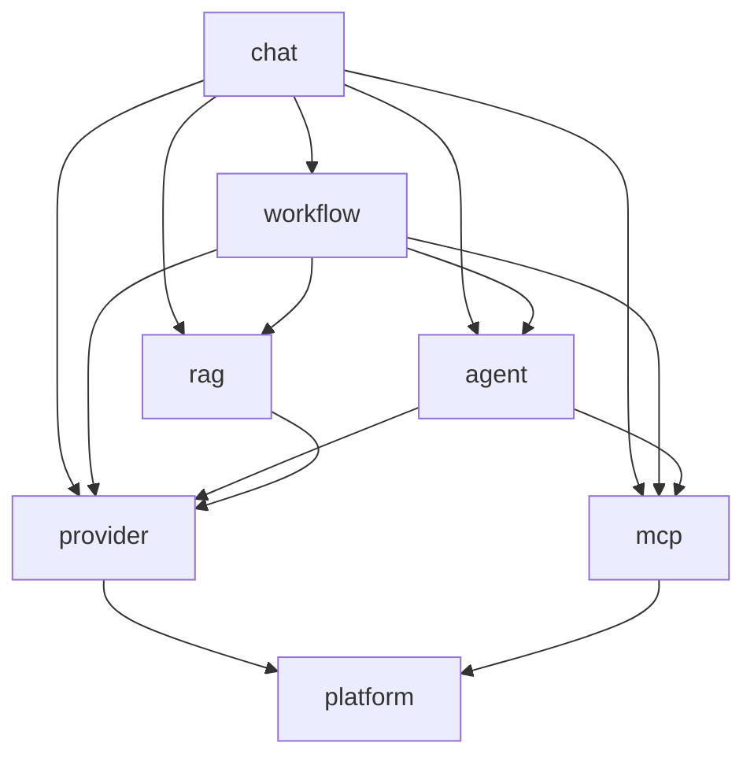

# CLAUDE.md

本文件是 Hify 的项目规范与 Claude Code 工作指南的唯一事实源。

## 项目概述

### 产品定位

Hify 是简化版 Dify 的 AI Agent 开发平台。约束（一切决策的前提）：

- 一个人开发，好维护优先，不追求大厂级架构
- 本地部署（Docker Compose 单机），面向 20-50 人团队内部使用
- 峰值 3-5 QPS，主要压力在流式 SSE 对话；瓶颈在 LLM 长连接，不在算力；单实例 2C4G 足够

### 做什么

**核心功能：**

- 多模型提供商管理：OpenAI / Claude / Gemini / Ollama 统一接入，API Key 加密存储
- Agent 创建与配置：选模型、绑 MCP 工具、设系统提示词
- 对话引擎：SSE 流式响应、多轮对话、上下文管理
- MCP 工具接入：Agent 通过 MCP 协议调用外部工具——区别于聊天机器人的关键能力
- 管理控制台：模型管理、Agent 配置、对话界面；带最简登录门槛

**降级做（做，但砍到最小）：**

- 知识库 + RAG：一期只支持 TXT / MD 纯文本文档，递归分割分块（段落→句子→硬截三级降级，MD 围栏原子保护），pgvector 向量召回（建表即建 HNSW 索引）
- 简版工作流：JSON 配置，线性 + 条件分支

**护栏与可观测：**

- 运行日志：每次调用的输入 / 输出 / 工具调用链 / token / 耗时，排障唯一线索
- LLM 成本护栏：每用户限流 + 每日预算熔断（防超支，头号风险项）

### 不做什么

- 可视化拖拽编排：已交付 spec 009 双模式（JSON / 拖拽，用户 2026-09-21 批准；原「不做」项，后端契约仍为 JSON 配置不变）
- 不做多租户 / 权限体系（只保留最简登录）
- 不做插件市场、计费系统、微调、标注
- 不做 WebApp 发布、嵌入组件（控制台对话界面是唯一用户入口）
- 不做多种部署形态（仅 Docker Compose 本地部署）

### 技术栈

- **后端**：Go 1.26 + Gin；GORM（CRUD）+ pgvector（向量召回走 `db.Raw` 原生 SQL）
- **数据**：PostgreSQL 17 + Redis 7.x；
- **AI 生态**：cloudwego/eino（多模型统一接入）
- **前端**：Vue 3 + TypeScript + Element Plus，Vite 构建；流式聊天 UI 无现成组件，SSE 渲染层手写
- **部署形态**：Docker Compose 单机，Go 单二进制 + alpine 镜像；PG 使用 `pgvector/pgvector:pg17` 镜像

### 部署与运维预期

- Docker Compose 本地一键部署，容器内存设上限（512m-1G）
- 目标：20-50 人同时在线，峰值 3-5 QPS，瓶颈在 LLM 长连接；按 100 并发 SSE 流留余量，每提供商 bulkhead 16 级
- 缓存只上三件：语义缓存（pgvector 相似度匹配 + Redis 存答案）、配置类 Cache-Aside（TTL 30 分钟 + 写时删 key）、静态资源长缓存；API 响应一律 `no-store`；全仓库 Redis key 统一 `hify:` 前缀（`redisx.Key` 拼接，命名空间隔离）
- 监控：起步 `/health` + 结构化日志（持久化到卷 + rotation，LLM 调用记 provider / model / token / 耗时 / 错误类），后期 Prometheus + Grafana
- 必做：PG 每日备份保留 7-14 天（唯一不可再生数据）；预算熔断 fail-open + 80% 告警；`restart: always` + healthcheck；磁盘告警与上线前泄漏 soak 测试
- 约定：迁移用 goose/golang-migrate + SQL，禁止 GORM AutoMigrate 做表结构演进；API Key 走 `.env` / Docker secrets，禁止入 Git

**SSE 链路（错任何一条流式就废）：**

- nginx：`proxy_buffering off` + `proxy_read_timeout 300s` + `proxy_http_version 1.1` + `X-Accel-Buffering: no`；SSE 路由绝不开 gzip
- Docker `ulimit nofile 65535`
- 三层超时（TTFT 20-30s / idle watchdog 30s / overall 5min）；客户端断连取消上游 LLM 调用（省 token）

## 代码组织规范

模块化单体，按业务域组织（domain-first）：每个业务域一个模块；模块的公开面有两个——跨模块调用走 `api` 包，HTTP 流量走 `handler` 路由；业务代码全部放 `internal/`（编译器禁止外部仓库引用）。对话引擎（chat）是未来的候选独立服务，必须始终保持可拆出状态。

> **基础 Go 编码风格**（格式、命名、错误处理、并发、日志 20 条核心）遵循全局规则 [~/.claude/rules/golang/coding-style.md](../../../../.claude/rules/golang/coding-style.md)。本节以下为 Hify 项目专属的代码组织与架构约定；与全局规则冲突时，以本节为准。

### 命名规范（Go 标准）

- **目录**：全小写、单个单词、不用下划线 / 连字符 / 驼峰；包名 = 目录名（`api` / `service` / `store` / `handler`）。
- **文件**：全小写 snake_case，按内容命名（`schema.go` / `model.go` / `store.go` / `handler.go`）；包内单文件时可用模块名（`provider.go`）。
- **import 别名**：跨包引用统一用 `<module><layer>` 形式别名——`providerapi "hify/internal/provider/api"`、`providersvc "hify/internal/provider/service"`、`providerstore "hify/internal/provider/store"`、`providerhandler "hify/internal/provider/handler"`——避免各模块同名包（api/service/store/handler）冲突。
- **类型名不与包名叠字**：api 包里叫 `ProviderService`（外部引用为 `api.ProviderService`），不叫 `APIProviderService`。
- **可见性 = 首字母大小写**：首字母大写即导出（公开），小写即包内私有；Go 以此控制可见性，不靠 `public` / `private` 关键字。
- **命名风格 = 驼峰**：导出标识符用大驼峰（PascalCase，如 `UserName`、`ProviderService`），包内私有用小驼峰（lowerCamelCase，如 `userName`、`localCache`）；不使用下划线 / 连字符命名标识符。
- **缩写词全大写或全小写，不首字母大写**：`UserID`（导出）/ `userID`（私有）、`HTTPClient`、`APIKey`（导出）/ `apiKey`（私有）；**禁止** `UserId`、`HttpClient`、`ApiKey`（golint 会报错）。
- **结构体字段保持驼峰，JSON snake_case 用 struct tag 映射**：字段名本身写驼峰（`APIKey string`），序列化下划线通过 tag 实现（`json:"api_key"`），**不改字段名**。即：Go 代码里只见到驼峰字段，snake_case 只出现在 `json` tag 与实际 JSON 报文里。
- **Getter 不加 `Get` 前缀，Setter 用 `Set`**：`u.Name()` 不写 `u.GetName()`；赋值用 `u.SetName(...)`。
- **命名导向**：函数 / 方法用动词（`Create` / `RotateKey` / `ListAgents`），结构体用名词（`Provider` / `AgentService`），接口用行为 + `-er` 后缀（`Store` / `Reader` / `Resolver`）。
- **module 路径**：`github.com/Karlsk/go-hify`（= 仓库路径，Go 惯例）；本文档 `hify/...` 形式的 import 为简写，实际写 `github.com/Karlsk/go-hify/...`。

### 包结构

```
cmd/hify/main.go              # 入口：加载配置 + 调 app.Run（~15 行，无装配细节）
internal/
├── app/                      # 组合根装配：Run(cfg) 集中所有 DI + gin 引擎/中间件/路由/启动
├── provider/                 # 模型提供商：API Key 加密存储、连通性探测、模型列表
├── agent/                    # Agent 配置：选模型、绑 MCP 工具、系统提示词
├── chat/                     # 对话引擎：SSE 流式、多轮上下文、工具调用循环
├── rag/                      # 知识库：TXT/MD 解析、递归分割分块、pgvector 召回
├── workflow/                 # 简版工作流：JSON 配置、线性 + 条件分支
├── mcp/                      # MCP 工具接入
├── auth/                     # 最简登录
└── platform/                 # 共享基建：被所有业务域依赖，不依赖任何业务域
    ├── config/               # .env / Docker secrets 加载与校验
    ├── db/                   # PostgreSQL 17 + pgvector 初始化
    ├── redisx/               # Redis 初始化与通用操作
    ├── llm/                  # eino 统一适配：provider 配置 → ChatModel 实例
    ├── budget/               # 每用户限流 + 每日预算熔断（fail-open + 80% 告警）
    ├── logging/              # slog 结构化日志（stdout + 文件 rotate + SetDefault + trace_id 从 ctx 自动追加）；executions 表归 chat/llm 模块
    ├── errs/                 # 跨业务域通用哨兵错误（gin 无关叶子包，供 respond/handler 用 errors.Is 映射）
    ├── authctx/              # 登录用户身份 ctx 注入/提取（业务模块不依赖 auth，身份类型下沉 platform）
    ├── traceid/              # 请求级 trace_id 生成 + ctx 注入/提取（gin 无关叶子包，同 authctx 形态；X-Request-ID）
    ├── httpmw/               # 全仓 gin 中间件：RequestID（trace_id 注入）/ AccessLog（访问日志、慢请求 WARN、SSE 豁免）
    ├── respond/              # 统一 API 响应信封（success / data / error / meta）
    ├── page/                 # 统一分页：偏移分页（配置表）+ 游标分页（大列表 keyset，禁 OFFSET）
    ├── timex/                # 统一时间序列化：纯日期 Date（yyyy-MM-dd）；datetime 用 time.Time 默认 RFC 3339
    ├── schema/               # 各模块 api 契约共用响应基类 BaseSchema（id 字符串化 + 双时间戳；纯标准库，与 db mixin 对称）
    └── cache/                # 配置类缓存管理器：按名 TTL + 写时删 key（Cache-Aside）；全仓库 key 经 redisx.Key 加 hify: 前缀
web/                          # Vue 3 前端，独立构建（目录结构、设计系统与约定见 web/README.md）
deploy/                        # Docker Compose 部署：前后端 Dockerfile、nginx 配置、compose、备份脚本（用法见 deploy/README.md）
migrations/                    # goose/golang-migrate SQL 文件（禁止 GORM AutoMigrate）
```

模块内部统一为四层子包：`api/`（契约层）/ `service/`（业务层）/ `store/`（数据层）/ `handler/`（HTTP 层），详见《模块内部结构》。

前端骨架（目录结构、技术栈版本、设计系统与视觉规范、请求 / SSE / 分页约定、开发命令）记录在 [web/README.md](web/README.md)；本节仅列顶层位置，前端规范以该文件为准。

### 依赖方向（单向，禁止循环）



> 图中箭头从依赖方指向被依赖方（A → B 表示 A 依赖 B）。所有业务域都依赖 `platform`，为减少 clutter 图中省略了指向 platform 的箭头（仅保留 provider / mcp 两条用于锚定底座）。箭头清单以下方依赖列表为准。

各模块允许的依赖（A → B 表示 A 依赖 B）：

- `provider → platform`
- `mcp → platform`
- `agent → provider, mcp, platform`
- `rag → provider, platform`（嵌入模型走 provider）
- `auth → platform`
- `chat → workflow, agent, mcp, rag, provider, platform`（对话中可触发工作流执行）
- `workflow → mcp, rag, provider, agent, platform`（工具节点走 mcp，知识检索节点走 rag）

规则：

- 依赖只能单向：chat 可以依赖 agent，agent 绝不能反过来依赖 chat。
- chat 处于依赖图最外层：任何业务域都不得依赖 chat（`main.go` 装配除外）。零被依赖是 chat 将来能整体拆成独立服务的前提。
- workflow 的 LLM 节点直接走 `platform/llm`，不得为执行节点而依赖 chat（工作流节点是单轮、无 SSE 的，不需要对话引擎的多轮上下文）。
- import 方向 = 依赖方向，由 Go 编译器强制：模块只能 import 上方清单中列出的下游模块的 `api` 包；import 上游模块必然构成包导入环、编译直接失败。
- platform 不依赖任何业务域。
- 跨模块调用一律经目标模块的 `api` 接口、实现由组合根注入，见下节《跨模块调用规则》。`api` 接口 + 组合根注入是将来把 chat 拆成独立服务的接缝：拆分时把注入的实现换成 RPC client，chat 业务代码不动。

### 跨模块调用规则

三条规则：

1. **调用只能经目标模块的 `api` 接口。** 禁止 import 其他模块的 `service` / `store` / `handler`。消费方以别名 import 目标模块的 api 包（如 `import providerapi "hify/internal/provider/api"`），service 结构体字段直接持有该接口类型，组合根把目标模块 `service.New(...)` 的返回值（即 api 接口的实现）注入。消费方禁止持有下游具体类型。
2. **跨模块传参 / 返回只用目标模块 `api/` 里定义的 schema。** 禁止传递 model（GORM 实体）或模块内部类型；schema↔model 转换发生在目标模块的 service 层。
3. **循环依赖 = 架构错误，立即重构。** Go 编译器直接拒绝 import 环；凡编译因环失败，必须重构（共用能力下沉 `platform/`），禁止任何绕过。

补充机制：

- `api` 接口方法签名固定：`(ctx context.Context, req XxxReq) (*XxxSchema, error)`；跨模块调用与 HTTP 请求复用同一套接口。
- 消费方默认直接持有下游 `api` 接口；若只用到一两个方法，可在消费方 service 包内另声明只含这几个方法的小接口（Go 小接口惯例，下游实现凭结构化类型天然满足，组合根注入方式不变）。
- import 方向仍受依赖清单约束：只能 import 下游模块的 api。
- 跨模块调用不走 HTTP 中间件：用户身份随 ctx 传递，限流 / 预算 / 审计由 platform 组件保证。
- 哨兵错误定义在目标模块的 `api/` 包，消费方用 `errors.Is` 判断。

示例：

```go
// 消费方：agent/service/service.go —— 只 import provider/api；持有 api 接口，不持有具体类型
import providerapi "hify/internal/provider/api"

type agentService struct {
    store    Store
    providers providerapi.ProviderService   // 组合根注入 provider 模块的 service 实现；测试可直接 stub
}

func (s *agentService) Create(ctx context.Context, req providerapi.CreateReq) error {
    // ...业务校验...
    p, err := s.providers.Get(ctx, providerapi.GetReq{ID: req.ProviderID})
    if err != nil {
        if errors.Is(err, providerapi.ErrProviderNotFound) { /* 哨兵错误处理 */ }
        return fmt.Errorf("load provider: %w", err)
    }
    // 使用 schema 字段...
    return nil
}
```

禁止清单（命中即违规）：

| 禁止 | 正确做法 |
|---|---|
| import 其他模块的 `service` / `store` / `handler` | 只 import 该模块的 `api` |
| service 字段持有下游具体类型 | 持有下游 `api` 接口，由组合根注入实现 |
| 跨模块传递 model 或模块内部类型 | 使用该模块 `api` 的 schema |
| handler 绕过本模块 api 接口直调本模块 service 具体类型 | handler 字段同样持有本模块 `api` 接口 |
| store 操作他模块的表 / JOIN 他模块的表 | 每个 store 只操作本模块 model 声明的表；跨模块数据在 service 分次查询后组装 |
| `*gin.Context` 传入 api 接口 / service | 传 `ctx context.Context` |

### 模块内部结构（四层子包）

```
internal/<domain>/
├── api/                     # 契约层 —— 纯包，模块对外的唯一契约
│   ├── api.go               # 跨模块调用接口：XxxService interface
│   └── schema.go            # Req/Schema 定义、Validate、哨兵错误
├── service/                 # 业务层 —— 实现 api 接口
│   ├── service.go           # 业务规则、事务边界、schema↔model 转换、错误翻译、Store 接口定义
│   └── model.go             # model：GORM 实体，模块私有，禁止跨模块
├── store/                   # 数据层 —— 实现 service.Store 接口（依赖倒置）
│   └── store.go             # GORM CRUD、pgvector 原生 SQL（db.Raw）
└── handler/                 # HTTP 层 —— gin 路由与绑定，薄绑定，无业务逻辑
    └── handler.go           # RegisterRoutes + 绑定函数，调本模块 api 接口
```

模块内依赖方向（单向）：`handler → api`、`service → api`、`store → service`（实现其 Store 接口、使用其 model 类型）。禁止 `service → store`、`service → handler`、`handler → service`（handler 只认 api 接口，具体实现由组合根注入）。

**各层职责边界：**

| 层 | 职责 | 禁止 |
|---|---|---|
| `api/` | 跨模块调用接口、Req/Schema、Validate、哨兵错误 | 含任何实现；import gin/gorm；import 本模块其他层或其他模块 |
| `service/` | 实现 api 接口；业务规则；定义 `Store` 接口；model；schema↔model 转换；错误翻译成哨兵错误；事务边界（`WithTx`） | import 本模块 `store` / `handler`；import 其他模块非 `api` 包；出现 gin 类型 |
| `store/` | 实现 `service.Store` 接口：GORM CRUD、pgvector 原生 SQL | 含业务逻辑；做业务错误翻译 |
| `handler/` | RegisterRoutes、参数绑定与校验、调本模块 api 接口、`errors.Is` 映射状态码、`respond` 包装 | 含业务逻辑；直接访问数据库；直接调用其他模块 |

**api/ —— 纯契约模板：**

```go
// api/api.go —— 纯契约：无实现，不 import gin/gorm
package api

// 跨模块调用接口；实现在本模块 service 包，由组合根注入消费方
type ProviderService interface {
    Get(ctx context.Context, req GetReq) (*ProviderSchema, error)
    Create(ctx context.Context, req CreateReq) (*ProviderSchema, error)
}

// api/schema.go —— 请求 / 响应 schema 与哨兵错误
type CreateReq struct {
    Name   string `json:"name" binding:"required,max=128"`
    APIKey string `json:"api_key" binding:"required"`
}
func (r CreateReq) Validate() error { /* 跨字段校验 */ return nil }   // binding tag 管字段格式，Validate 管跨字段规则

type ProviderSchema struct { ... }

var ErrProviderNotFound = errors.New("provider not found")
```

规则：`api/` 是叶子包，只 import 标准库与纯标准库的 platform 小包（`platform/schema` 的 `BaseSchema`：id 字符串化 + 双时间戳，主键非代理 id 或 append-only 的表自行声明）；不 import gin/gorm；schema 上的 `binding:"..."` 是纯字符串 tag，不引入 gin 依赖。

**service/ —— 业务层模板：**

```go
package service

import (
    providerapi "hify/internal/provider/api"
)

// Store 数据层接口：定义在消费方（本包），store 包实现，组合根注入 —— 依赖倒置
type Store interface {
    GetByID(ctx context.Context, id uint64) (*Provider, error)
    Create(ctx context.Context, p *Provider) error
    WithTx(ctx context.Context, fn func(tx Store) error) error
}

type providerService struct {
    store Store
    // 下游依赖：持有其他模块的 api 接口（组合根注入）
}

// New 返回 api 接口类型：组合根拿到后可直接注入任何消费方
func New(store Store) providerapi.ProviderService { return &providerService{store: store} }

func (s *providerService) Get(ctx context.Context, req providerapi.GetReq) (*providerapi.ProviderSchema, error) {
    p, err := s.store.GetByID(ctx, req.ID)
    if err != nil {
        if errors.Is(err, gorm.ErrRecordNotFound) {
            return nil, providerapi.ErrProviderNotFound      // 边界处错误翻译：原始错误 → 哨兵错误
        }
        return nil, fmt.Errorf("get provider %d: %w", req.ID, err)   // %w 包装，不吞错
    }
    return toSchema(p), nil                                  // 边界处 model → schema 转换
}

// 事务边界：只出现在 service 层；fn 内只操作本模块的表
func (s *providerService) RotateKey(ctx context.Context, id uint64, newKey string) error {
    return s.store.WithTx(ctx, func(tx Store) error {
        if err := tx.UpdateKey(ctx, id, newKey); err != nil { return err }
        return tx.TouchRotatedAt(ctx, id)
    })
}
```

```go
// service/model.go —— model（GORM 实体）模块私有，禁止跨模块；json 序列化是 schema 的事，model 不打 json tag
type Provider struct {
    ID   uint64 `gorm:"primaryKey"`
    Name string `gorm:"size:128;not null"`
}
func (Provider) TableName() string { return "providers" }
```

规则：

- 业务方法第一参数恒为 `ctx context.Context`；全程不出现 gin 类型。
- schema↔model 转换、哨兵错误翻译都发生在这一层（实现 api 接口的边界上）；`toSchema` / `toModel` 转换函数写在本包。
- 下游依赖一律是其他模块的 `api` 接口（或按小接口惯例收窄的接口）；禁止出现其他模块的具体类型。
- 业务规则（唯一性检查、预算检查、编排顺序）只出现在这里。

**store/ —— 数据层模板（实现 service.Store）：**

```go
package store

import (
    providersvc "hify/internal/provider/service"
)

var _ providersvc.Store = (*Store)(nil)   // 编译期断言：Store 实现了 service.Store

type Store struct{ db *gorm.DB }
func New(db *gorm.DB) *Store { return &Store{db: db} }

// WithTx 事务：fn 拿到包装了 tx 句柄的 Store（仍以 service.Store 接口身份传入）
func (s *Store) WithTx(ctx context.Context, fn func(tx providersvc.Store) error) error {
    return s.db.WithContext(ctx).Transaction(func(gtx *gorm.DB) error {
        return fn(&Store{db: gtx})
    })
}

func (s *Store) GetByID(ctx context.Context, id uint64) (*providersvc.Provider, error) {
    var p providersvc.Provider
    err := s.db.WithContext(ctx).First(&p, id).Error    // 未找到原样返回 gorm.ErrRecordNotFound
    return &p, err
}
```

规则：

- 方法命名：Create / GetByID / List… / Update… / Delete… / Exists… / FindBy…；方法集与 `service.Store` 接口逐一对应。
- error 原样上抛：可用 `%w` 加上下文，不做业务翻译。
- 只操作本模块 model 声明的表；pgvector 召回的原生 SQL（`db.Raw`）写在本模块 store。

**handler/ —— HTTP 层模板（薄绑定）：**

```go
package handler

import (
    providerapi "hify/internal/provider/api"
)

type Handler struct{ svc providerapi.ProviderService }   // 持有本模块 api 接口，组合根注入 service 实现
func New(svc providerapi.ProviderService) *Handler { return &Handler{svc: svc} }

func (h *Handler) RegisterRoutes(rg *gin.RouterGroup) {
    g := rg.Group("/providers")
    g.POST("", h.create)
    g.GET("/:id", h.get)
    g.POST("/:id/test", h.testConnection)
}

func (h *Handler) create(c *gin.Context) {
    var req providerapi.CreateReq
    if !respond.BindJSON(c, &req) {                        // 绑定 + 校验合一步：失败已写 400 信封，直接 return
        return
    }
    resp, err := h.svc.Create(c.Request.Context(), req)    // 调本模块 api 接口
    if err != nil {
        if errors.Is(err, providerapi.ErrProviderNameConflict) { // 模块哨兵：errors.Is → 显式状态码 + code（= 哨兵 Error()）
            respond.Fail(c, http.StatusConflict, providerapi.ErrProviderNameConflict.Error(), err.Error())
            return
        }
        respond.FailFromSentinel(c, err)                   // 通用哨兵自动映射，其余兜底 500 + 记日志
        return
    }
    respond.OK(c, resp)                                    // 包装响应
}
```

规则：

- 绑定函数命名用 REST 动词：create / get / list / update / delete，非 CRUD 用动作名（如 testConnection）；绑定 + 校验合一步走 `respond.BindJSON`（Req 须实现 `Validate()`，即 `respond.Validatable`），失败已写 400 信封、handler 直接 return；一个绑定函数只调一个接口方法。
- 错误响应一律走 `respond.Fail*` 信封：模块哨兵先 `errors.Is(err, …)` → `respond.Fail(c, 状态码, 哨兵.Error(), err.Error())` 显式映射，通用哨兵与未识别错误走 `respond.FailFromSentinel(c, err)`（自动映射 / 兜底 500）。`error.code` 只能是哨兵的 `Error()` 字符串，禁止裸字符串或原始异常文本上抛。
- handler 只 import 本模块 `api` + `platform/respond` + gin + net/http（状态码常量），不 import 本模块 `service` / `store`。

**组合根（`cmd/hify/main.go` → `internal/app/server.go`）：** 只装配，无业务。`main.go` 是入口（加载配置 + 调 `app.Run(cfg)` + 处理退出码，~15 行），装配细节集中在 `internal/app/server.go` 的 `Run`——预先拆分、保持 main 精简，装配增长只动 server.go。沿依赖清单自下游而上游，每个模块按 store → service → handler 顺序构建；下游模块 `service.New(...)` 的返回值就是 api 接口，直接作为上游 `service.New(...)` 的入参注入：

```go
providerStore := providerstore.New(db)
providerSvc   := providersvc.New(providerStore)              // 返回 providerapi.ProviderService
agentStore    := agentstore.New(db)
agentSvc      := agentsvc.New(agentStore, providerSvc)       // 下游 api 接口直接注入
// ... mcp / rag / workflow / chat 同理，chat 最后（依赖图最外层）
providerhandler.New(providerSvc).RegisterRoutes(rg)          // handler 注入同一个 api 实现
```

步骤：1. 加载配置 → 2. 初始化 platform（db / redis / llm / budget / logging）→ 3. provider → mcp → agent → rag → workflow → chat → 4. 挂中间件（`respond.Recovery()` 必须最外层，兜底其后所有中间件 / handler 的 panic），调各模块 RegisterRoutes → 5. 启动服务。（本仓库已预先拆分到 `internal/app/server.go`，server.go 再长也不回流 main.go；原「单文件超 400 行拆 `internal/app/`」门槛已提前执行。）

**全模块通则：**

- 不建全局类型包：schema 在各模块 `api/`，model 在各模块 `service/model.go`；不建全局 `model/`、`schema/` 包。各模块 model 的表与关系总览见 [核心数据模型](docs/design/data-model.md)。
- 错误链路：store 原样上抛 → service 翻译成 api 哨兵错误（其余 `%w` 包装）→ handler 用 `errors.Is` 映射状态码，非哨兵错误经 `respond.Error` 统一 500；任何一层不得静默吞错。
- 测试与被测代码同包（`*_test.go`）：service 测试直接 stub 本模块 `Store` 接口与下游 api 接口（只用到少数方法时，stub 可内嵌接口、只覆写用到的方法）；store 测试用 sqlmock 注入 mock DB；handler 测试用 `httptest` 走绑定函数。覆盖率 ≥ 80%。

## 外部 LLM 调用设计（platform/llm）

所有 LLM 调用（chat 对话、workflow LLM 节点、provider 连通性探测）一律经 `platform/llm`；超时 / 重试 / 熔断逻辑只写在这一层。Go 并发模型下瓶颈不在线程——100 条 SSE 流 = 100 个阻塞在 netpoller 上的 goroutine、0 个 OS 线程——而在两件事：每供应商的并发槽位、每次调用的时间边界。

### 错误分类

`platform/llm` 定义统一错误类，adapter 负责把各家错误格式翻译过来。分类决定一切：重不重试、计不计熔断、给用户看什么。

| 错误类 | 典型来源 | 可重试 | 计入熔断失败 |
|---|---|---|---|
| `Timeout`（TTFT / idle / overall） | 各家 | ✅ | ✅ |
| `RateLimited` | OpenAI / Gemini 429 | ✅（先尊重 Retry-After） | ❌（限流 ≠ 故障） |
| `Overloaded` | Claude 529、各家 503 | ✅ | ✅ |
| `Network`（连接拒绝、reset） | 各家 | ✅ | ✅ |
| `InvalidRequest`（400、上下文超长、内容过滤） | 各家 | ❌ 重试也不会好 | ❌ |
| `Auth`（401 / 403） | Key 失效 | ❌ | ❌ |
| `ProviderDown` | Ollama 连接拒绝 | ❌ | ✅ |

### 并发控制（bulkhead）

- 不用 worker pool：LLM 调用是纯网络等待，goroutine 阻塞代价≈0；限的是"对供应商的在途调用数"，不是 goroutine 数量。
- 每供应商 16 槽（`golang.org/x/sync/semaphore`，ctx 感知）；抢槽超时 5s，拿不到槽 fail-fast 返回 `ErrProviderBusy`（HTTP 503），不无限排队——排队放大超时级联，且等 30 秒再成功不如立刻报错让用户重试。
- 槽位释放在流的终点（wrapStream 的 Close），不是函数返回；重试全程持有槽位。
- 定制 http transport：`MaxIdleConnsPerHost` = 16（对齐槽位数，复用 keep-alive 省 TLS 握手）、`IdleConnTimeout` 90s、`DialContext` 5s、`TLSHandshakeTimeout` 10s、`ResponseHeaderTimeout` = TTFT + 5s（保证永远是 ctx 先到期、错误类是我们的而不是 net/http 的模糊错误）。

### 熔断

- 每供应商一个 `sony/gobreaker`：连续 5 次**最终失败**（重试耗尽后才记一次，重试过程中的失败不逐次计数）→ 打开 30s → 半开放 1 个探测请求。
- 只对 Timeout / Overloaded / Network / ProviderDown 计数；429 走重试路径，不触发熔断。
- 熔断打开时秒拒"供应商暂不可用"：不在死供应商上空转重试，不让用户干等 5 分钟超时。
- 不手写熔断状态机。

### 超时（三层）

| 层 | 默认值 | 实现 | 备注 |
|---|---|---|---|
| TTFT（首 token） | 30s | `context.WithTimeoutCause(ctx, 30s, ErrTTFT)` | 首 chunk 到达即失效，切换为 idle 看门狗 |
| Idle 看门狗 | 30s | 每收一个 chunk 重置计时器；到点 cancel，cause=`ErrIdle` | eino 的 `Recv()` 阻塞无超时参数，只能靠 cancel ctx 打断 |
| Overall | 5min | 最外层 timeout，包住重试在内的全过程 | 防"慢滴流"：一直出字但永不结束 |

- 一律用 `WithTimeoutCause` + `context.Cause(ctx)`，不用裸 `WithTimeout`：排障时区分"首字慢"还是"中途断流"，这是运行日志"错误类"字段的来源。
- 每供应商覆盖：Ollama 冷启动要加载模型，TTFT=120s 并设 `OLLAMA_KEEP_ALIVE` 保温；思考模式模型首字前静默久，TTFT 按模型上调。
- 绝不设 `http.Client.Timeout`——它覆盖整个 body 读取，会把 30 秒的流在到点时腰斩。
- 客户端心跳：流空闲时每 15s 发一行 SSE 注释（`: ping`）。
- 嵌套关系：客户端断连 ctx ⊂ overall ⊂ 单次 attempt（TTFT → idle），任何一层先到上层全部感知；客户端断连取消上游调用（省 token）。

### 重试纪律

- 默认最多 2 次重试（共 3 次尝试），且**只在首 token 之前**。
- 首 token 之后失败：发 `event: error` SSE 事件（含错误码 + `retryable` 标志）→ 关流 → 前端展示"生成中断 + 重新生成"；不续传、不自动重试（流式调用没有幂等点，重试会让用户看到重复文本）。
- 可重试判定 = 错误分类表"可重试"列 ∧ 尚未吐出任何 token；每次尝试前检查 `ctx.Err()`，客户端已断连就不再重试。
- 退避：指数 + 满抖动，`sleep = rand(0, min(8s, 500ms × 2^attempt))`。
- 429 带 Retry-After：按头睡眠（解析失败回退退避），封顶 10s——超过 10s 直接放弃重试，返回"供应商限流，请稍后再试"。内部工具里让用户等 40 秒换一个可能成功的重试，不如让他 1 秒后自己点重试。
- 成本说明：失败尝试的 token 基本不计费；最坏 3 倍放大被 overall 超时与预算护栏双重兜住。

### 每供应商 Profile 与行为差异

```go
// platform/llm/profile.go —— 每供应商一份，以下为默认值，可被 DB 里的 provider 配置覆盖
type Profile struct {
    Bulkhead        int           // 16
    AcquireTimeout  time.Duration // 5s
    TTFT, Idle, Overall time.Duration // 30s / 30s / 5min（Ollama TTFT=120s）
    MaxRetries      int           // 2
    BackoffBase, BackoffCap time.Duration // 500ms / 8s
    RetryAfterCap   time.Duration // 10s
    BreakerAfter    int           // 5
    BreakerCooldown time.Duration // 30s
}
```

| 供应商 | 流式特性 | 主要失败形态 | 专门处理 |
|---|---|---|---|
| OpenAI | 标准 SSE | 429（含 Retry-After）、偶发 5xx | 429 走 Retry-After 路径 |
| Claude | 事件类型丰富（message_start / content_block_delta…） | 529 overloaded、400 上下文超长 | 529 按可重试 5xx 对待 |
| Gemini | SSE 帧式不同、项目级 QPM 配额 | 429 | 配额 429 倾向 fail-fast |
| Ollama | 本地 NDJSON、无鉴权 | 连接拒绝、模型冷加载慢 | TTFT 120s；连接拒绝立即计熔断 |

### 调用链（一次流式调用，全部在 platform/llm 内）

```
抢槽位(sem, 5s fail-fast)
  → 过熔断器(open 则秒拒)
    → 重试循环(≤3 次, 仅首 token 前):
        attempt ctx = WithTimeoutCause(overall ctx, TTFT)
        stream = eino.Stream(attemptCtx, in)
        首 chunk 到达 → 切 idle 看门狗(每 chunk 重置 30s)
        失败且可重试 → 退避 / 等 Retry-After 后重试
    → 重试耗尽 → 记一次熔断失败 + 错误分类入日志
  → 返回 wrapStream(读完 / Close 时释放槽位, 透传 ctx 取消)
```

### 供应商降级（fallback）

一期不做，留配置位：Agent 表预留 `fallback_model_id` 字段。启用语义：仅首 token 之前的失败生效，切备用模型，最多一跳；备用模型价格不同、与预算护栏有交互，启用前须确认。

### 禁止清单

| 禁止 | 正确做法 |
|---|---|
| 重试 / 超时 / 熔断逻辑出现在 chat / workflow / provider | 只写在 `platform/llm`，一处实现全局复用 |
| 给流式 client 设 `http.Client.Timeout` | 超时全交给 ctx 三层（TTFT / idle / overall） |
| 首 token 之后重试 | 发 `event: error` SSE 事件关流，前端重新生成 |
| 抢槽无限排队 | 5s fail-fast 返回 503 |
| 429 计入熔断失败 | 429 走 Retry-After / 退避路径 |
| 用 worker pool 限制 LLM 并发 | 每供应商 semaphore（bulkhead 16） |

### 验证

集成测试用故障注入代理（toxiproxy 一类）制造延迟首包 / 中途断流 / 429 / 500，断言看门狗触发、重试次数、熔断打开；service 层测试 stub eino 的 ChatModel 接口。

## 部署架构

单机 Docker Compose，**4 个常驻容器 + 1 个定时容器**，2C4G 预算内。唯一对外暴露的是 nginx 的 443；Go、PG、Redis 全部走 compose 内部网络，不暴露端口。

> 本节描述的部署形态已落地为 [deploy/](deploy/)（docker-compose.yml + 前后端 Dockerfile + nginx.conf + 备份脚本），部署步骤见 deploy/README.md；`make start ENV=prod` / `make stop ENV=prod` 走容器，`ENV=dev` 走本地脚本。

```
┌────────────────────────── Docker Compose 单机 (2C4G) ──────────────────────────┐
│                                                                                │
│  浏览器 (Vue SPA)                                                               │
│       │ HTTPS :443                                                             │
│       ▼                                                                        │
│  ┌────────────────────────────────────────────────────────────────────────┐   │
│  │  nginx  (nginx:alpine)  入口网关：TLS / 静态资源 / 反代 / SSE 透传         │   │
│  └───────┬───────────────────────┬────────────────────────────────────────┘   │
│          │ 静态 /assets/*          │ /api/*                                    │
│          │ (长缓存)                ▼                                            │
│          │              ┌─────────────────────────┐                           │
│          │              │  hify  (Go 单二进制)      │   auth / agent / chat /   │
│          │              │  :8080 唯一业务进程       │   rag / workflow / mcp     │
│          │              │  platform/llm: bulkhead  │   budget 护栏 / logging    │
│          │              │  → 熔断 → 超时 → 重试      │                           │
│          │              └──────┬─────────────┬────┘                           │
│          │                     │ GORM        │ go-redis                        │
│          │                     ▼             ▼                                 │
│          │              ┌────────────┐  ┌────────────┐                         │
│          │              │ postgres   │  │ redis      │  语义缓存 / 配置缓存 /    │
│          │              │ pg17+vector│  │ :7         │  限流计数 / 预算计数      │
│          │              │ HNSW 索引  │  └────────────┘                         │
│          │              └────────────┘                                        │
│          │                                                                     │
│          └──▶ hify ──▶ 外部 LLM：OpenAI / Claude / Gemini / Ollama（SSE/NDJSON）│
│                                                                                │
│  backup 容器（每日 cron）──▶ pg_dump ──▶ backups 卷（保留 7-14 天）              │
└────────────────────────────────────────────────────────────────────────────────┘
```

### 组件清单与职责

| 组件 | 镜像 | 职责 | 不做 |
|---|---|---|---|
| **nginx** | `nginx:alpine`（pinned） | ① TLS 终结 ② 服务 Vue 构建产物，`/assets` 长缓存、`index.html` no-cache ③ `/api/*` 反代到 `hify:8080` ④ SSE 透传：`proxy_buffering off` + `X-Accel-Buffering: no` + `proxy_read_timeout 300s`，SSE 路由绝不开 gzip ⑤ 请求体大小限制 | 不做负载均衡（单实例）；不做业务逻辑 |
| **hify** | 多阶段构建，`golang:1.26-alpine` 编 → `alpine` 跑，非 root，`-ldflags="-s -w"` | ① 全部 API 与业务：auth（最简登录）、provider、agent、chat（SSE 流式）、rag、workflow、mcp ② `platform/llm` 统一 LLM 接入（bulkhead 16/供应商、熔断、三层超时、重试）③ `platform/budget` 每用户限流 + 每日预算熔断（fail-open + 80% 告警）④ `platform/logging` 结构化运行日志 ⑤ `/health` 健康检查（含 PG/Redis 连通性） | 不直接暴露端口；不托管静态文件（交给 nginx） |
| **postgres** | `pgvector/pgvector:pg17` | ① 唯一事实源：provider / agent / chat / workflow / rag 等关系数据 ② pgvector HNSW 索引，向量召回走原生 SQL（`db.Raw`）③ 表结构演进走 goose/golang-migrate | 不做缓存；不做复杂视图/物化 |
| **redis** | `redis:7-alpine` | ① 语义缓存（pgvector 相似度命中 → 直接回答案）② 配置类 Cache-Aside（TTL 30min + 写时删 key）③ 限流 / 预算计数器（`INCR` + 过期）④（可选）登录 session；全仓库 key 统一 `hify:` 前缀 | 不做消息队列；不做主从 |
| **backup** | `postgres:17-alpine` + cron | 每日 `pg_dump` 落 `backups` 卷，保留 7–14 天 | 只在 cron 时点跑，平时不占资源 |

> 前端静态服务放 nginx 而非 `go:embed`：Vue 独立构建产物直接打进 nginx 镜像，前端改动只重建 web 镜像、后端零重启；长缓存控制也天然在 nginx。备选 `go:embed` 能合并成"真·单二进制"，但每次前端改动都要重建 Go 镜像，一人维护下不划算。

### 请求流转

**① 静态资源**（浏览器 → nginx，不经过 Go）
```
GET / → nginx 返回 index.html（no-cache，带 hash 引用 assets）
GET /assets/*.js|css → nginx 直接回，Cache-Control: immutable, max-age=1y
```

**② 常规 REST**（如登录、模型管理、Agent 配置）
```
浏览器 → nginx(443) → hify /api/xxx
  → auth 中间件（最简登录校验，session/Redis）
  → 业务模块（GORM CRUD → PG；配置走 Cache-Aside → Redis）
  → respond 统一信封（success/data/error/meta），响应头 no-store
  → 浏览器
```

**③ SSE 对话流（核心链路，错一步流式就废）**
```
浏览器 POST /api/v1/conversations/{id}/messages (fetch + ReadableStream，而非 EventSource——要带 body 和鉴权头；stream:true 流式 / stream:false 一次输出 JSON)
  → nginx：proxy_buffering off / proxy_cache off / proxy_http_version 1.1
           X-Accel-Buffering: no；该路由绝不开 gzip；proxy_read_timeout 300s
  → hify：
      auth → budget 检查（Redis 计数，fail-open）
      → 取 agent 配置、组装多轮上下文（PG）
      → [RAG 路径] pgvector 相似度召回 → 注入上下文
      → platform/llm：抢槽(5s fail-fast) → 过熔断器 → eino.Stream
      → 三层超时（TTFT 30s / idle 30s / overall 5min）
      → MCP 工具调用循环（如绑定）
      → SSE writer：逐 chunk 写回；空闲时每 15s 发 `: ping`
  客户端断连 → hify 的 ctx 取消 → 取消上游 LLM 调用（省 token）
  → nginx 透传（只转发，不缓冲）→ 浏览器逐字渲染
```

**④ 内部数据访问**（compose 内部网络，不经 nginx）
```
hify ──▶ postgres:5432   GORM CRUD / pgvector 召回
hify ──▶ redis:6379      语义缓存 / 配置缓存 / 限流预算计数
hify ──▶ 外部 LLM API    每个供应商独立 bulkhead 16 槽
```

### 网络、卷与安全

- **网络**：单一 compose bridge network；仅 nginx 映射 `443:443`（HTTP 可 80→443 跳转）。PG/Redis/hify 无 host 端口。
- **卷**：`pgdata`（唯一不可再生数据）、`backups`（每日备份 7-14 天）、`logs`（结构化日志 + rotation）、`redisdata`（AOF 持久化，预算计数不能因重启清零）。
- **密钥**：全部走 `.env` 注入 compose + 容器环境变量，PG 密码、Redis 密码、LLM API Keys；**禁止入 Git**。Provider 模块的 API Key 在 DB 内加密存储，主密钥来自 env。
- **运行**：所有容器 `restart: always` + `ulimit nofile 65535`；Go 以非 root 运行。

### 资源分配（2C4G）

| 容器 | 内存上限 | 说明 |
|---|---|---|
| hify | 512m–1g | SSE 流 + 100 并发 goroutine 余量；大头是流缓冲区 |
| postgres | 768m | `shared_buffers=256m`、`effective_cache_size=1g` 级 |
| redis | 256m | 缓存 + 计数 |
| nginx | 128m | |
| backup | 偶发 | cron 时点短跑，峰值约 100m |

合计常驻 ≈ 1.7G，余量留给 PG 缓存页与峰值。

### 健康检查与观测

- **healthcheck（每容器）**：hify `/health`（探 PG + Redis，返回 degraded/503）、PG `pg_isready`、Redis `redis-cli ping`、nginx 静态探测。`restart: always` 兜底。
- **一期可观测 = `/health` + 结构化日志**（持久化到 `logs` 卷 + rotation，LLM 调用记 provider/model/token/耗时/错误类）。Prometheus + Grafana 明确列为后期，不在一期架构里占内存。
- **预算告警**：每日预算 80% 触发告警（fail-open：超支不阻断在线会话，但告警 + 拒绝新会话）。

### 边界（当前阶段明确不做）

- 不做多副本 / 负载均衡 / 水平扩展——3-5 QPS 单实例足够，nginx 只是网关不是 LB。
- 不做 Prometheus/Grafana 常驻——起步日志 + healthcheck 够了。
- 不做 PG 主从/高可用——单机 Compose 定位，数据安全靠每日备份而非副本。
- 不做 Redis Cluster / 哨兵。

## 性能瓶颈与一期必做

核心判断：2C4G 对 3-5 QPS 的 CRUD 与 100 条 SSE goroutine 绰绰有余——CPU、内存（Ollama 不进本栈，常驻 ≈1.7-2.2G，余量充足）、goroutine、nginx、Redis、磁盘全非瓶颈。瓶颈集中在三处：外部 LLM 的时延与限流（不可控）、bulkhead 把上游时延变成吞吐上限（可控）、语义缓存的 embedding 自造串行调用（可控）。一期必须做收敛为三条：

### ① bulkhead 可调 + soak 验证（P0，不重构只监控）

bulkhead 16 槽 + fail-fast 503 是正确的背压设计，**不改架构**；但 16 是默认值不是写死的常量，是否够用只能实测。

- `Profile.Bulkhead` 走配置加载（默认 16，可被 DB 里 provider 配置覆盖），禁止当编译期常量。
- fail-fast 计数进结构化日志（供应商 + `ErrProviderBusy` 字段），一期即可统计 503 率。
- 上线前 soak 测按 50 用户峰值画像（长短对话混合、集中打主力 Agent/供应商）持续 30-60 分钟，记录 503 率 + 内存/goroutine/连接稳定性，用结果定初始 bulkhead 值。
- 关键提醒：供应商自己的配额（RPM/TPM/QPM）可能比 16 槽先顶到——soak 测要分清"我的槽顶到"还是"供应商 429 顶到"，后者调 bulkhead 无意义，该换更高配额 key 或分流量。

### ② embedding 复用 + 独立槽 + 降级（P0，若启用语义缓存）

语义缓存的查询路径是 消息 → embedding（LLM 调用 #1）→ pgvector 相似度 → miss → chat 调用（#2）→ 写缓存。embedding 一次 ~200ms–1s+，会把 cache-miss 的成本和 TTFT 翻倍。

- 写缓存**复用读路径已算出的 query 向量**，绝不再为写缓存发一次 embedding。
- embedding 调用走**独立槽位**，不挤占 chat 的 bulkhead；单独设短超时（如 5s）。
- embedding 失败时**降级为普通对话**（不命中缓存直接走 LLM），不把缓存做成硬依赖。
- 监控语义缓存命中率；命中率低于阈值时缓存是负担而非收益。
- 留接口：二期 RAG 召回与语义缓存共享同一 query 向量，一次 embedding 喂两处。

### ③ PG 连接池上限（P1，一行成本）

GORM 默认 `MaxOpenConns` 无上限；若流式路径持事务，100 并发即可耗尽 PG 连接。

- db 初始化设 `SetMaxOpenConns` / `SetMaxIdleConns`（按 2C4G ~20/5 量级）、`SetConnMaxLifetime`。
- 约定：流式路径只读不写、不持事务；执行日志在流结束后的短连接里写。

## 数据库规范

PG17 + pgvector 的表结构与性能规范，覆盖字段约定、SQL 编写、事务与 DDL、索引、大表、分页、向量索引。AI 建表时按《建表执行清单》逐条过。表归属与关系见 [核心数据模型](docs/design/data-model.md)。与 MySQL 规范的取舍见本节末。

### SQL 通用字段约定

标准表头（每张表必备）：

```sql
id         bigint GENERATED ALWAYS AS IDENTITY PRIMARY KEY,
created_at timestamptz NOT NULL DEFAULT now(),
-- updated_at 仅可变表有（见下）
```

> **Go 侧表头**：上述标准表头由 `internal/platform/db` 的 mixin 提供，各模块 `service/model.go` 按表性质 embed 即可，不必重复声明 id / created_at：
> - `db.BaseAppendOnly`（id + created_at）—— append-only 表（executions / messages / chunks）；
> - `db.BaseMutable`（+ updated_at，`autoUpdateTime`）—— 可变表（providers / agents / ...）；
> - `db.BaseSoftDelete`（+ deleted_at，`gorm.DeletedAt` 自动加 `WHERE deleted_at IS NULL`）—— 一期无使用者（软删已全面退役，见下），mixin 保留备用。
>
> model 只带 `gorm` tag、不带 `json` tag（序列化是 api/schema 的事，ID 的 `"id,string"` 在 schema 上做）；表的真实 DDL（含 `GENERATED ALWAYS AS IDENTITY`、partial 索引）仍由 migrations/ SQL 决定，本包从不 AutoMigrate。

列类型规则：

| 用途 | 类型 | 禁止 |
|---|---|---|
| 主键 / 外键 ID | `bigint GENERATED ALWAYS AS IDENTITY` | `int`、随机 UUID（破坏索引局部性） |
| 字符串 | `text` | `varchar(N)`（PG 无性能差异，长度约束用 CHECK 或应用层） |
| 时间 | `timestamptz`（一律存 UTC） | `timestamp` |
| 枚举（role / status / error_class） | `text` + `CHECK (x IN (...))` | PG `enum` 类型（加值要 `ALTER TYPE`，演进麻烦） |
| JSON（workflows.config / executions.tool_chain） | `jsonb` | `json` |
| 金额 / token 计数 | `numeric` / `bigint` | `float` |
| 布尔标志 | `boolean` | 字符串/整数代布尔 |
| 向量 | `vector(维度)`（pgvector，维度按嵌入模型固定） | — |

`updated_at` 归属：

- **append-only 表**（`executions` / `messages` / `chunks`）：只有 `created_at`，不要 `updated_at`。
- **可变表**（`providers` / `agents` / `mcp_servers` / `knowledge_bases` / `workflows` / `conversations` / `documents`）：加 `updated_at`，GORM `autoUpdateTime` 维护；日后引入裸 SQL UPDATE 路径再加 `BEFORE UPDATE` 触发器兜底。
- **无软删除**（`deleted_at` 已全面退役，迁移 00013）：可逆下架统一由业务 `enabled` 布尔开关承担（可见、可恢复——KB / Agent 轻量停用，Document 深度停用 = 事务删向量分块、内容保留、重新启用自动重跑入库管线）；DELETE = 真删（级联清理，误删兜底 PG 每日备份）。Agent 有历史会话时 FK RESTRICT 挡删（409 `AGENT_IN_USE`）。不引入 `deleted_at` 列。

命名（建表直接照抄）：

- 表名 snake_case **复数**（`providers` / `messages` / `chunks`，与 GORM `TableName` 一致）。
- 列名 snake_case；外键列 `<单数>_id`（`provider_id` / `agent_id` / `conversation_id`）。
- 索引 `idx_<表>_<列>`；唯一 `uq_<表>_<列>`；外键约束 `fk_<表>_<引用>`。

约束：列尽量 `NOT NULL`（只有真可为空才允许 NULL）；外键默认 `ON DELETE RESTRICT`，仅真子表用 `CASCADE`（`conversations` 删 → `messages` 级联；`documents` 删 → `chunks` 级联）。

注释与可维护性：

- 每张表、每个非显而易见的列都写 `COMMENT ON`（用途 / 单位 / 取值含义，中文），建表脚本里一并写，别等事后补：

```sql
COMMENT ON TABLE executions IS '每次 LLM 调用一行：输入/输出/工具链/token/耗时/错误类，排障唯一线索';
COMMENT ON COLUMN executions.error_class IS 'Timeout/RateLimited/Overloaded/Network/InvalidRequest/Auth/ProviderDown，见 platform/llm 错误分类';
```

- **禁止预留字段**（`field1` / `reserve1` / 拿 `ext` 当垃圾场）——需要时再加列。冗余字段仅限"确定不再变更"的派生值（如 `executions` 冗余存 `model_name` 方便排障），并必须注释来源与同步时机。

### 索引设计原则

按优先级：

1. **每个外键必须单独建索引**（PG 不自动建）。漏建 = 慢 JOIN + DELETE 锁升级。检测脚本见《监控》。
2. **复合索引：等值列在前，范围/排序列在后。**
3. **按访问模式建索引，不是按列建**——从真实 WHERE/ORDER BY 推导；用 `pg_stat_user_indexes` 复查，删未用索引。
4. **partial 索引**给稀疏标志（`WHERE status IN ('pending','processing')`、`WHERE error_class IS NOT NULL`）——更小更快。
5. **covering 索引（`INCLUDE`）**只给已证实的热读路径。
6. **向量列一律建 HNSW**（`chunks.embedding`），建表即建，参数与 ops 类见《pgvector 索引规范》。
7. **GIN 只给"按 jsonb 内容过滤"的场景**；纯整块存取（`workflows.config` 按 id 取）不要 GIN。
8. **append-only 大表的时间范围扫描用 BRIN**（极小，适合天然有序的 `created_at`）。
9. **别过度索引**——每个索引都吃写入和空间。

Hify 索引地图（建表时照抄；向量索引细节见《pgvector 索引规范》）：

| 表 | 索引 |
|---|---|
| `models` | `(provider_id)` |
| `mcp_tools` | `(mcp_server_id)` |
| `agents` | `(model_id)`、`(fallback_model_id)`、`(workflow_id)`（spec 05） |
| `agent_tools` | id PK + `uq(agent_id, tool_id)` + 反查 `(tool_id)` |
| `agent_knowledge_bases` | PK `(agent_id, knowledge_base_id)` + 反查 `(knowledge_base_id)` |
| `knowledge_bases` | `(embedding_model_id)` |
| `documents` | `(knowledge_base_id)` + partial `(status) WHERE status IN ('pending','processing')`（入库中扫描，00011 起） |
| `document_chunks` | HNSW 向量索引（见《pgvector 索引规范》） + `(document_id)` + `(knowledge_base_id)`（冗余 KB 归属，检索单表过滤免 JOIN，00011 起） |
| `conversations` | `(user_id, updated_at DESC, id DESC)`（列表分页）、`(agent_id)` |
| `messages` | `(conversation_id, id)`（上下文按序取） |
| `executions` | `(conversation_id, created_at)`、`(model_id)`；规模上来后 `BRIN (created_at)` + partial `(error_class) WHERE error_class IS NOT NULL` |
| `workflows` | `uq_workflows_name (name)` |
| `workflow_nodes` | `(workflow_id)` |
| `workflow_edges` | `(workflow_id)` |
| `workflow_runs` | `(workflow_id, created_at DESC)`（按工作流查运行历史，00019）；`parent_run_id` 无索引（spec 08：子 run 按父关联是低频排障路径、每父行数个，00020 只加列） |
| `workflow_node_runs` | `(run_id)` + uq `(run_id, seq)`（run 内 seq 回放序，00019） |
| `providers`/`users`/`mcp_servers` | PK + 业务唯一键（`providers.name`、`users.username`） |

### SQL 编写规范

写 SQL（store 层 GORM / `db.Raw`、service 层裸 SQL）逐条对照：

| 规则 | 说明 |
|---|---|
| 禁 `SELECT *` | 显式列出所需列。省带宽、省 TOAST 解压、减少对"加列"的耦合；`executions.input/output` 等大文本尤甚（见《大表处理策略》）。 |
| DML 必带 `WHERE` | `UPDATE`/`DELETE` 无 `WHERE` = 全表灾难；上线前先 `SELECT ... 同 WHERE` 数行数确认。 |
| 参数类型 = 列类型 | `WHERE bigint_col = $1` 绑定 bigint，别传字符串触发隐式转换丢索引（PG 对 `text = bigint` 会插 cast，索引失效）。 |
| `IN` 列表封顶 | 建议 ≤1000；大批量用 `= ANY($1::bigint[])` 或 JOIN 子查询/临时表，别拼超长 IN。 |
| `LIKE` 禁前导通配 | `LIKE 'x%'` 走索引，`LIKE '%x'` 全表扫；模糊匹配用 `pg_trgm` GIN 索引，分词搜索用 `tsvector`。 |
| `OR` 改写 | 多用 `IN` 或 `UNION ALL`；`OR` 常让优化器放弃索引、且难估计行数。 |
| JOIN ≤ 3 表 | 更多表分次查询、service 层组装（与跨模块不 JOIN 一致，见《跨模块调用规则》）；每条 JOIN 的 ON 列必须有索引。 |
| 大结果集分页 | 永不一次性 `SELECT` 全表回内存；走《分页查询规范》的 keyset 或游标批量。 |

NULL 语义（写查询必记）：

- 判空用 `IS NULL` / `IS NOT NULL`；`col = NULL` 恒为 `unknown`，查不出任何行。
- 聚合忽略 NULL：`COUNT(col)` 不数 NULL 行、`COUNT(*)` 数所有行，二者不等价——要"非空计数"显式选对。
- 唯一约束对 NULL：PG 默认多行 NULL **不**冲突（可并存多个 NULL）。需要"某列非空时唯一"用 partial unique：`CREATE UNIQUE INDEX uq_x_col ON x (col) WHERE col IS NOT NULL`。

### 事务与 DDL 规范

事务（service 层 `WithTx`）：

- **事务最小化**：只包必须原子化的写。事务内**禁止**外部调用（HTTP / LLM / 阻塞式 Redis / 等用户输入）——长事务持有锁、阻塞 autovacuum 回收死元组（MVCC 膨胀），是 PG 性能头号陷阱。
- 事务内只操作本模块的表；跨模块数据在 service 层分次查询后组装，见《跨模块调用规则》。
- 行锁显式且范围最小：`SELECT ... FOR UPDATE` 带走索引的 `WHERE`，别锁全表；高频竞态优先**乐观锁**（`version` 列 + CAS UPDATE `WHERE version = $1`）。
- 死锁预防：一次事务更新多张表 / 多行时按**固定顺序**（如按 id 升序）加锁，避免交叉等待。
- 批量写用一条多 VALUES 的 `INSERT`（如 chunks 入库），禁循环单行 INSERT。

DDL 与表结构演进：

- 演进走 migrations（goose / golang-migrate + SQL），**禁止 GORM `AutoMigrate`**（顶层已定）。迁移文件只增不改、顺序幂等。
- 加索引用 `CREATE INDEX CONCURRENTLY`（不阻塞写）——**不能在事务块内执行**，迁移工具须对该语句关事务包装（goose `// +goose NO TRANSACTION`）。
- 加列：PG 11+ `ADD COLUMN ... DEFAULT 常量 NOT NULL` 瞬时完成（不重写）；但无默认的 `NOT NULL` 加列、或默认值为 volatile 函数（如 `gen_random_uuid()`）会**全表重写 + 锁表**——大表按"加可空列 → 回填 → 加默认 → 改 NOT NULL"分步做。
- 禁高峰期对大表做全表重写 DDL；PG `enum` 类型已因 `ALTER TYPE` 演进麻烦被 `text + CHECK` 替代，避免再引入。

### 大表处理策略

按增长速度排序，**只有前三张需要专门策略，其余按常规即可**：

| 表 | 增长 | 策略 |
|---|---|---|
| `executions` | 最快（每次 LLM 调用一行，含工具轮次） | **按月分区 + 90 天保留（`EXECUTIONS_RETENTION_DAYS` 可配）** |
| `messages` | 次快（append-only） | 监控，~10M 行再分区 |
| `chunks` | 受文档量约束；受限于 HNSW 索引内存 | 监控索引大小 vs 内存（见《pgvector 索引规范》） |
| `conversations`/`documents` | 中等 | 常规索引 |
| 配置表（providers/agents/models/...） | 极小、静态 | PK + 业务唯一键即可 |

**① executions —— 唯一值得"建表即分区"的表。** 时间序列、append-only、有明确保留期（排障窗口默认 90 天，`EXECUTIONS_RETENTION_DAYS` 可配）。分区好处：drop 旧分区瞬间完成、每分区索引小、autovacuum 友好。**后来再转分区要整表重写**，所以现在就做：

```sql
CREATE TABLE executions (
    id              bigint GENERATED ALWAYS AS IDENTITY,
    conversation_id bigint NOT NULL,
    model_id        bigint,
    -- ...其他列...
    created_at      timestamptz NOT NULL DEFAULT now(),
    PRIMARY KEY (id, created_at)          -- 分区键必须在主键里
) PARTITION BY RANGE (created_at);

CREATE TABLE executions_2026_08 PARTITION OF executions
    FOR VALUES FROM ('2026-08-01') TO ('2026-09-01');

-- 父表建索引自动传播到所有分区
CREATE INDEX idx_executions_conv_time ON executions (conversation_id, created_at);
```

分区自动化：**应用内后台任务**（`internal/platform/logging/partition.go` 的 `PartitionMaintainer`，组合根 `go Start(appCtx)`，同 provider StartProber 模式随优雅关停退出）——启动立即首轮 + 此后每 24h 一轮，dev（`make start`）与 prod（compose）同路径生效：

- 建分区：幂等 `CREATE TABLE IF NOT EXISTS executions_YYYY_MM PARTITION OF …`，每轮保证**当月 + 下月**存在（跨月零感知；边界字面量用裸日期，与迁移 DDL 同形由服务器时区解释）。
- 删分区：**分区结束日 + 保留天数 < now（严格 <）才 drop**——在线窗口恒 ≥ 保留期（默认 90 = 实际 90~120 天锯齿），不按下探到 61 天的「分区起始 90 天」判定。
- 保留期 `EXECUTIONS_RETENTION_DAYS`（默认 90）：`<=0` 关闭维护（启动 WARN，不建不删）；「永不删除」用超大值（如 36500）表达，不设第三态。单实例部署假设，不加 advisory lock（IF NOT EXISTS 幂等兜底）。
- 曾由 backup 容器 cron SQL 维护（`deploy/backup/partition_maintenance.sql`，已下线）——backup 回归 pg_dump 单一职责，且容器方案在 dev 模式不生效曾导致缺分区写入失败。规则切换（起始判定 → 整体判定）后的首轮会比旧规则多保留约一个月，预期行为。

> 区分两个"保留"：**PG 每日备份 7-14 天**是灾难恢复（所有数据）；**executions 在线保留 `EXECUTIONS_RETENTION_DAYS` 天（默认 90）**是查询窗口——超期 drop 分区，历史仍可从备份恢复。

**② messages —— 监控阈值。** 50 人阶段一年几十万行，不用分区；但**现在就把 `created_at` 当一等列设计好**，跨 ~10M 行再按月分区（append-only 可在线搬，迁移成本可接受）。

**③ chunks —— 内存约束。** HNSW 索引驻留内存，文档量大时是真正的内存瓶颈，详见《pgvector 索引规范》。

通用大表纪律：

- `executions` 含 `input`/`output` 大文本——查询**不要 `SELECT *`**，不需要时别取这两列（大文本自动 TOAST，不取零成本）。
- 文档入库的 chunks **批量 INSERT**，别逐行。
- 任何新列表查询合并前跑 `EXPLAIN (ANALYZE, BUFFERS)`，确认走索引、大表不许 seq scan。

### 分页查询规范

1. **默认 keyset（游标）分页，禁用 OFFSET**——OFFSET 深翻页 O(n)，keyset O(1)。仅 agents/providers 等极小表可例外。
2. **游标必须稳定唯一**：以 `id` 做决胜列，`ORDER BY sort_col DESC, id DESC`。
3. **作用域列表用复合游标**（如会话列表按用户）。
4. **大列表不算精确 `COUNT(*)`**：用 `LIMIT n+1` 判 `has_more`，或 `pg_class.reltuples` 近似。
5. **每个 LIMIT 服务端封顶**（如 100），永不无界。

会话列表（按用户，最新优先）：

```sql
SELECT id, title, agent_id, updated_at
FROM conversations
WHERE user_id = $1
  AND (updated_at, id) < ($last_updated, $last_id)   -- 首页省略此行
ORDER BY updated_at DESC, id DESC
LIMIT 21;   -- 取 21 返 20，has_more = (行数 = 21)
-- 配套索引：(user_id, updated_at DESC, id DESC)
```

消息上下文（按会话，正序）：

```sql
SELECT ... FROM messages
WHERE conversation_id = $1 AND id > $last_id
ORDER BY id LIMIT 50;
-- 配套索引：(conversation_id, id)
```

### pgvector 索引规范

向量列（`chunks.embedding`，维度按嵌入模型固定，如 1536/3072）召回是 RAG 与语义缓存的核心读路径，索引选错则召回慢或内存爆。

**用 HNSW，不用 IVFFlat。** HNSW 查询召回率高、无需训练、随数据增长性能平滑；IVFFlat 适合数据量极大且可离线调 `lists`，Hify 的向量规模（万–百万级）HNSW 更省心。

建表即建索引（参数为 pgvector 推荐默认，建表直接抄）：

```sql
CREATE INDEX idx_chunks_embedding ON chunks
    USING hnsw (embedding vector_cosine_ops)
    WITH (m = 16, ef_construction = 64);
```

关键点：

- **ops 类用 `vector_cosine_ops`**：嵌入向量的语义相似度按余弦距离衡量（多数嵌入模型按余弦相似度训练），建库与查库距离度量必须一致；换距离（如内积 `vector_ip_ops`）需要向量归一化前提，不要混用。
- **维度固定**：`vector(维度)` 一旦建表不可改，换嵌入模型（维度变）需要重建 `chunks` 与索引——这是"嵌入模型绑定知识库"的原因。
- **`ef_search` 是查询时旋钮**：HNSW 的 `m` / `ef_construction` 在建索引时定（影响索引大小与构建速度），`ef_search` 在查询时设（影响召回率 vs 延迟，越大越准越慢）。召回路径按召回率调，会话级 `SET LOCAL hnsw.ef_search = 80;`（默认 40），调到"召回达标且 p99 延迟可接受"为止。
- **过滤召回**：RAG 按 KB / `document_id` 过滤是常态。HNSW + `WHERE` 默认 postfilter（先 ANN 再过滤，过滤严时召回数不足）；过滤后候选集很小时让 `WHERE` 走 `(document_id)` btree 先缩范围更稳。单 KB 向量数大时优先按 KB 物理拆分，而非一个超大索引 + 强过滤。
- **内存约束（chunks 的真实瓶颈）**：HNSW 索引驻留 RAM，磁盘换页会令召回延迟暴涨。监控 `pg_relation_size('idx_chunks_embedding')` vs 容器可用内存，索引超过内存约 70% 即告警；控制单 KB 向量数、必要时按 KB 分表。**向量表不要分区**——HNSW 跨分区无法全局 ANN，召回效果差。
- **召回评估**：上线前用一批"问题→已知正确 chunk"样本跑 top-k 命中率，定 `ef_search` 初值；别凭感觉。

### 建表执行清单（AI 每张表过一遍）

- [ ] 表名 snake_case 复数；列 snake_case；外键 `<单数>_id`
- [ ] `id bigint GENERATED ALWAYS AS IDENTITY PRIMARY KEY`
- [ ] `created_at timestamptz NOT NULL DEFAULT now()`；可变表加 `updated_at`
- [ ] 类型对表（text/timestamptz/jsonb/bigint/numeric/boolean/vector）
- [ ] 枚举用 `text + CHECK`，非 PG enum
- [ ] 列尽量 `NOT NULL`；外键 `ON DELETE RESTRICT`（真子表才 CASCADE）
- [ ] **每个外键都建索引**
- [ ] 复合索引等列在前、范围在后；稀疏标志用 partial
- [ ] 向量表建 HNSW（见《pgvector 索引规范》）
- [ ] 列表查询走 keyset、LIMIT 封顶、不算精确 COUNT
- [ ] `executions` 按月分区；其余大表确认是否到阈值
- [ ] 表与非常规列写了 `COMMENT ON`；无预留字段
- [ ] 查询无 `SELECT *`；DML 带 `WHERE`；参数类型对齐列类型
- [ ] 事务最小化、事务内无外部调用；批量写用多 VALUES INSERT
- [ ] 加索引用 `CONCURRENTLY`（关事务）；加 NOT NULL 列避免全表重写

### 监控（周期性跑）

```sql
-- 漏建索引的外键
SELECT conrelid::regclass AS table_name, a.attname AS column_name
FROM pg_constraint c
JOIN pg_attribute a ON a.attrelid = c.conrelid AND a.attnum = ANY(c.conkey)
WHERE c.contype = 'f'
  AND NOT EXISTS (
    SELECT 1 FROM pg_index i
    WHERE i.indrelid = c.conrelid AND a.attnum = ANY(i.indkey));

-- 慢查询（需 pg_stat_statements 扩展）
SELECT query, mean_exec_time, calls FROM pg_stat_statements
WHERE mean_exec_time > 100 ORDER BY mean_exec_time DESC;

-- 未使用的索引（候选删除）
SELECT relname, indexrelname, idx_scan
FROM pg_stat_user_indexes WHERE idx_scan = 0 ORDER BY relname;

-- 向量索引大小 vs 内存（chunks 内存约束）
SELECT pg_size_pretty(pg_relation_size('idx_chunks_embedding'));

-- 表膨胀
SELECT relname, n_dead_tup, last_vacuum FROM pg_stat_user_tables
WHERE n_dead_tup > 1000 ORDER BY n_dead_tup DESC;
```

### 与 MySQL 规范的取舍说明

阿里 / 互联网公司 MySQL 规范是经典参考，但 Hify 是 PostgreSQL——以下几点**刻意偏离** MySQL 惯例，照抄 MySQL 规范会写错，列出原因防日后被"纠正"回 MySQL：

| 议题 | MySQL / 阿里规范 | Hify (PG) 选择 | 原因 |
|---|---|---|---|
| 表名 | 单数 | **复数**（`providers`） | 与 GORM `TableName` 默认一致，省配置 |
| 外键 | 禁用、应用层维护一致性 | **启用** `ON DELETE RESTRICT/CASCADE` | 单机 20-50 人规模，FK 强一致性兜底收益 > 其锁/级联成本 |
| 字符串 | `varchar(N)`，超长（>5000）拆 text 表 | **一律 `text`** | PG text 与 varchar 无性能差异；长度约束用 CHECK 或应用层 |
| 枚举 | `enum` | **`text` + `CHECK`** | PG enum 加值要 `ALTER TYPE` 影响全表；text+CHECK 加值只改 CHECK |
| 金额 | `decimal` | **`numeric`** | PG numeric 任意精度，等价 decimal 且更通用 |
| 时间 | `datetime` / `timestamp` | **`timestamptz`** | 一律存 UTC，PG timestamptz 自带时区正确性 |
| 主键 | `bigint unsigned` 自增 | **`bigint GENERATED ALWAYS AS IDENTITY`** | PG 标准、合 SQL 规范、防手填 |
| 布尔 | `tinyint(1)` / `is_xxx` | **`boolean`** | PG 原生布尔，不混用整数代布尔 |

> 借鉴的、与 MySQL 共通的原则（本规范已采纳）：索引前置等值列、每个 FK 建索引、禁 `SELECT *`、DML 带 WHERE、事务最小化、禁预留字段、`NOT NULL` 优先、金额不用浮点。

## 接口规范

Hify 后端所有 HTTP 接口的统一规范，与《代码组织规范》handler 四层定位一致：handler 薄绑定，响应一律经 `platform/respond` 信封。AI 写 handler 时逐条对照。

### 路径与版本

- 统一前缀 `/api/v1`；破坏性变更升 `/api/v2`，旧版并存至前端迁移完成。
- RESTful 资源路径：`/api/v1/{资源复数名}`，多词 kebab-case（`knowledge-bases`、`mcp-servers`）。
- 方法语义：`GET` 列表/详情、`POST` 创建、`PUT` 整体更新、`PATCH` 局部更新、`DELETE` 删除；非 CRUD 动作用 `/动词` 子路径，如 `POST /providers/{id}/test-connection`。
- SSE 流式走 **POST**（要带 body + 鉴权），绝不用 GET / `EventSource`。

资源清单（按模块）：

| 模块 | 资源 | 代表路由 |
|---|---|---|
| auth | session | `POST /auth/login`、`POST /auth/register`、`POST /auth/logout`、`GET /auth/me` |
| provider | providers、models | `/providers`、`/providers/{id}/models`、`/providers/{id}/test-connection` |
| mcp | mcp-servers、tools | `/mcp-servers`、`/mcp-servers/{id}/tools`、`/mcp-servers/{id}/discover` |
| agent | agents | `/agents`、`/agents/{id}/mcp-tools`、`/agents/{id}/knowledge-bases` |
| rag | knowledge-bases、documents | `/knowledge-bases`、`/knowledge-bases/{id}/documents`、`/documents/{id}/reindex` |
| chat | conversations、messages | `POST /conversations`（绑 agent 建会话）、`/conversations/{id}/messages`（发消息：`stream` 开关两模式 + 历史查询）、`DELETE /conversations/{id}` |
| workflow | workflows | `/workflows`、`/workflows/{id}/execute` |

> `GET /health`（探 PG + Redis）在 `/api/v1` 之外、不需鉴权。

### 统一响应信封

所有接口返回 `respond.Result`：

```jsonc
// 成功
{ "success": true,  "data": { /* 业务载荷 */ }, "error": null, "meta": { /* 可选：分页等 */ } }
// 失败
{ "success": false, "data": null,
  "error": { "code": "PROVIDER_NOT_FOUND", "message": "提供商不存在", "details": null },
  "meta": null }
```

- `success`：布尔，等价 HTTP 2xx，前端快速分支。
- `data`：业务载荷；无载荷（204）省略整个响应体。
- `error`：仅失败时非空，结构见《错误处理》。
- `meta`：可选元数据，当前只放分页信息（见《分页》）。
- 成功响应头一律 `Cache-Control: no-store`；静态资源长缓存在 nginx，不经此信封。

> 与 `{code,message,data}` 风格的区别：Hify 不把 HTTP 状态码复制进 body——HTTP 状态本身即 `code`，机器可读码进 `error.code`。一处定义（`platform/respond`），全接口复用。

### 字段命名与类型

- **命名**：JSON 字段 snake_case（与 Go schema 的 `json` tag、DB 列名一致），如 `api_key`、`created_at`、`model_id`。Go 结构体字段本身保持驼峰（如 `APIKey`、`CreatedAt`），snake_case 只出现在 `json` tag 与实际报文里——见《命名规范（Go 标准）》。
- **ID 序列化为字符串**：bigint 主键/外键在 JSON 里一律输出字符串（Go 用 `json:"id,string"`），避免 JS 超过 `2^53` 丢精度（`"id": "12345678901234567"`，不是数字）。URL `{id}` 同样按字符串传。
- **时间**：RFC 3339 / ISO 8601，UTC，带 `Z`，如 `"2026-08-10T12:34:56Z"`。datetime 字段用标准库 `time.Time`（Go 默认即按 RFC 3339 输出，不输出 Unix 时间戳，无需任何开关）；纯日期字段（无时分秒）用 [`platform/timex`](internal/platform/timex/date.go).`Date`（序列化为 `"2006-01-02"`，可空用 `*Date`）。
- **枚举**：字符串（`"role": "assistant"`、`"status": "processing"`），与 DB 的 `text+CHECK` 对齐，不传数字。

### 空值约定

- 列表字段空 → `[]`，不返回 `null`（前端免空判断）。
- 字符串字段空 → `""`，不返回 `null`。
- 对象字段不存在/未加载 → `null`。
- Go 侧：列表用 `make(..., 0)` 兜底，别让 nil slice 序列化成 `null`。

### 分页

两种模式，按资源增长性选用（与《数据库规范》keyset 强制、OFFSET 例外一致）：

**A. 游标分页（默认，大列表必用）** —— `conversations` / `messages` / `executions`：

```
GET /api/v1/conversations?limit=20&cursor=eyJpZCI6MTIzNH0
```

```jsonc
{ "success": true, "data": [ /* ... */ ],
  "meta": { "limit": 20, "has_more": true, "next_cursor": "eyJpZCI6MTI1NH0" } }
```

- `limit`：页大小，默认 20，上限 100；`cursor`：上一页 `next_cursor`，首页省略。
- `cursor` 不透明（base64 排序键），前端原样回传；`has_more=false` 时 `next_cursor` 为 `null`。
- 后端实现 = keyset 查询（`LIMIT n+1` 判 `has_more`），禁用 OFFSET。

**B. 偏移分页（仅极小静态配置表）** —— `providers` / `agents` / `models` / `mcp_servers` / `knowledge_bases` / `workflows`：

```
GET /api/v1/providers?page=1&page_size=20
```

```jsonc
{ "success": true, "data": [ /* ... */ ],
  "meta": { "page": 1, "page_size": 20, "total": 47 } }
```

- `page` 从 1 起，`page_size` 默认 20 上限 100；这类表行数极小，`total` 可精确算、OFFSET 无性能问题，且原生适配 Element Plus 分页组件。

### 错误处理

HTTP 状态码是主信号，`error.code`（机器可读字符串）供前端分支，`message` 人类可读。

HTTP 状态映射：

| 状态 | 语义 | Hify 触发场景 |
|---|---|---|
| 200 | 成功 | GET / PUT / PATCH 返回体 |
| 201 | 创建成功 | POST 创建 |
| 204 | 无内容 | DELETE、无返回体的更新 |
| 400 | 请求非法 | 参数绑定/校验失败、LLM `InvalidRequest`（上下文超长、内容过滤） |
| 401 | 未认证 | 未登录 / session 失效 |
| 404 | 不存在 | 资源未找到（哨兵 `ErrXxxNotFound`） |
| 409 | 冲突 | 唯一约束冲突（如 `providers.name` 重复） |
| 429 | 限流 | 用户限流或每日预算耗尽（拒绝新会话） |
| 500 | 服务器错误 | 未预期错误（经 `respond.Error` 统一 + 记日志） |
| 503 | 暂不可用 | bulkhead 抢槽失败（`ErrProviderBusy`）、熔断打开、供应商宕机 |

错误码（字符串，`MODULE_REASON` 命名空间；哨兵错误的 `Error()` 即码）。哨兵按产生层分散，不集中：跨域通用码在 `platform/errs`，LLM 操作码在 `platform/llm`，业务码在各模块 `api/errors.go`；handler 用 `errors.Is` 映射状态码，通用兜底走 `respond.FailFromSentinel`。

| 码 | HTTP | 哨兵位置 / 来源 |
|---|---|---|
| `UNAUTHORIZED` | 401 | `authapi.ErrUnauthorized` |
| `SESSION_EXPIRED` | 401 | `authapi.ErrSessionExpired`（session 失效） |
| `VALIDATION_FAILED` | 400 | `errs.ErrValidationFailed`（`details` 含字段级错误） |
| `PROVIDER_NOT_FOUND` | 404 | `providerapi.ErrProviderNotFound` |
| `PROVIDER_NAME_CONFLICT` | 409 | `providerapi.ErrProviderNameConflict`（唯一约束） |
| `PROVIDER_DISABLED` | 503 | `providerapi.ErrProviderDisabled`（提供商已停用，拒绝新调用） |
| `MODEL_NOT_FOUND` | 404 | `providerapi.ErrModelNotFound` |
| `MODEL_ID_CONFLICT` | 409 | `providerapi.ErrModelIDConflict`（uq(provider_id, model_id)） |
| `MODEL_IN_USE` | 409 | `providerapi.ErrModelInUse`（被 agents / knowledge_bases 引用，删除被挡） |
| `PROVIDER_BUSY` | 503 | `llm.ErrProviderBusy`（bulkhead fail-fast） |
| `PROVIDER_UNAVAILABLE` | 503 | `llm.ErrProviderUnavailable`（熔断打开 / `ProviderDown`） |
| `RATE_LIMITED` | 429 | `errs.ErrRateLimited`（供应商 429 透传 / 用户限流） |
| `BUDGET_EXHAUSTED` | 429 | `errs.ErrBudgetExhausted`（每日预算耗尽，新会话被拒） |
| `SERVICE_UNAVAILABLE` | 503 | `errs.ErrServiceUnavailable`（通用 503 兜底） |
| `AGENT_NOT_FOUND` | 404 | `agentapi.ErrAgentNotFound` |
| `AGENT_DISABLED` | 503 | `agentapi.ErrAgentDisabled`（Agent 已停用，新会话被拒） |
| `AGENT_IN_USE` | 409 | `agentapi.ErrAgentInUse`（Agent 有历史会话，删除被 FK RESTRICT 挡） |
| `CONVERSATION_NOT_FOUND` | 404 | `chatapi.ErrConversationNotFound` |
| `MODEL_CONTEXT_TOO_LONG` | 400 | `chatapi.ErrModelContextTooLong`（chat service 翻译自 llm `InvalidRequest`） |
| `WORKFLOW_NOT_FOUND` | 404 | `workflowapi.ErrWorkflowNotFound`；`agentapi.ErrWorkflowNotFound`（agent 侧绑定写入同码哨兵，FK 23503 约束名分发翻译——agent 不依赖 workflow，FK 是其存在性的唯一校验）；spec 08 另触发于执行期被引 workflow 已删（fail-fast，带父 node 前缀） |
| `WORKFLOW_NAME_CONFLICT` | 409 | `workflowapi.ErrWorkflowNameConflict`（workflow 名称唯一约束） |
| `WORKFLOW_NOT_PUBLISHED` | 503 | `workflowapi.ErrWorkflowNotPublished`（workflow 未发布，执行被拒；spec 08 起嵌套执行时子图非 published 同拒，带父 node 前缀） |
| `WORKFLOW_IN_USE` | 409 | `workflowapi.ErrWorkflowInUse`（被 agent 绑定，删除被 FK RESTRICT 挡，spec 05） |
| `WORKFLOW_EXECUTION_FAILED` | 500 | `workflowapi.ErrWorkflowExecutionFailed`（执行引擎环境限制类：api 节点 SSRF 拦截 / 总时长超 5min，spec 06） |
| `KNOWLEDGE_BASE_NOT_FOUND` | 404 | `ragapi.ErrKnowledgeBaseNotFound`（KB 不存在）；`agentapi.ErrKnowledgeBaseNotFound`（agent 侧绑定写入同码哨兵，FK 23503 翻译——agent 不依赖 rag，FK 是 KB 存在性的唯一校验） |
| `MCP_SERVER_NOT_FOUND` | 404 | `mcpapi.ErrMCPServerNotFound` |
| `INTERNAL_ERROR` | 500 | `errs.ErrInternal`（兜底，不向前端泄露细节） |

规则：

- 码命名 `MODULE_REASON`，全大写下划线；**新增码必须先有 `api/` 包哨兵错误**，再在 handler 加 `errors.Is` → 状态映射——不存在只改前端、后端无对应哨兵的码。（spec 08 workflow 分型与嵌套**哨兵零新增**——四类复用既有行：NOT_FOUND / NOT_PUBLISHED / VALIDATION_FAILED / EXECUTION_FAILED，嵌套错误经 message 的父 node 前缀链定位。）
- `error.details`：字段级校验错误放这里（`{"fields":[{"field":"name","msg":"required"}]}`）。
- 500 类不回原始堆栈给前端，只回 `INTERNAL_ERROR` + trace_id，细节进结构化日志（见《部署架构》logging）。
- 流式模式的错误见《对话接口》：流已 200 开始，后续错误用 `error` 事件（`type` 判别）携带 `code` + `retryable`，不改 HTTP 状态。

### 认证

- `POST /api/v1/auth/register` 开放注册（20-50 人内部工具，用户名唯一，密码 bcrypt 哈希）；`POST /api/v1/auth/login` 成功后下发 session（cookie 名 `hify_session`：HttpOnly + SameSite=Lax，Secure 由 `AUTH_COOKIE_SECURE` 控制——生产 HTTPS 开、本地 dev 关；session 本体存 Redis（key `hify:session:{token}`，只存最小身份 UserID/Username/CreatedAt，不含密码哈希），256bit 随机 token，TTL 7 天）。
- 其余 `/api/v1/*` 除 `auth/login`、`auth/register` 外一律经 auth 中间件（gin 的 `Use` 只对之后注册的路由生效——组合根先挂中间件再 RegisterRoutes，login/register 由中间件内部白名单放行）。业务 API 一期不按用户隔离，但仍要求登录门槛；身份经 `platform/authctx` 注入 ctx，供 budget 计数与后续 `user_id` 落库。
- SSE 用 `fetch` + `credentials: "include"`（带 cookie），**不用 `EventSource`**（不能自定义 header / 带鉴权）。
- 用户身份随 `ctx` 注入下游，跨模块调用与 HTTP 复用同一套接口；限流 / 预算在 platform 层按 ctx 内用户计数（见《跨模块调用规则》）。

### 对话接口（SSE 流式 + 一次输出，核心链路错一步流式就废）

对话走 RESTful 会话资源，建会话即绑 Agent（中途不换）：

```
POST   /api/v1/conversations                 # {"agent_id":"..."} 创建会话
GET    /api/v1/conversations                 # 会话列表（keyset 分页）
GET    /api/v1/conversations/{id}/messages   # 历史消息（正序游标 after_id）
DELETE /api/v1/conversations/{id}            # 删除会话（messages 级联删）
POST   /api/v1/conversations/{id}/messages   # 发消息（两模式，见下）
```

发消息请求体极简（会话已绑 agent、无变量注入，不需要 Dify 式 `inputs`）：

```jsonc
{ "content": "Hify 怎么创建 Agent？", "stream": true }   // stream 缺省 true
```

**流式模式（`stream: true`，缺省，控制台主模式）**：响应 `Content-Type: text/event-stream`；事件用 `data: JSON` 帧内 `type` 判别（不用 `event:` 命名行——fetch 手写解析少一层），SSE 注释行做心跳：

| type | data | 时机 |
|---|---|---|
| `citations` | `{citations: [{document_id, document_name, similarity}]}` | RAG 引用来源（首个 delta 前发；空引用不发此帧） |
| `delta` | `{content: "..."}` | 每个 token 片段 |
| `tool_call` | `{id, tool, args}` | 触发 MCP 工具调用 |
| `tool_result` | `{id, tool, result}` | 工具返回 |
| `done` | `{message_id, usage:{input,output}, finish_reason}` | 正常结束（`message_id` 供重新生成/反馈锚定） |
| `error` | `{code, message, retryable}` | 异常结束 |
| *(注释)* `: ping` | — | 空闲每 15s 心跳（防中间层掐静默连接：Ollama TTFT 120s / 思考模型首字久 / 工具执行慢） |

- 无 `meta` 事件：显式建会话后 `conversation_id` 已知，`message_id` 挪进 `done`。
- 流一旦返回 200，后续错误只能用 `error` 事件表达（HTTP 状态码不可改）。
- `retryable=true`（首 token 前 429 / 超时 / 网络错误）：前端可一键"重新生成"；`retryable=false`（`MODEL_CONTEXT_TOO_LONG`、`UNAUTHORIZED`）：不重试，提示用户改输入。
- 客户端断连 → 服务端 ctx 取消 → 取消上游 LLM 调用（省 token，见《外部 LLM 调用设计》）。
- 链路由 nginx 保证：`proxy_buffering off` + `X-Accel-Buffering: no` + `proxy_read_timeout 300s`，SSE 路由绝不开 gzip。

**一次输出模式（`stream: false`）**：内部跑同一条 Agent 循环（含工具调用；**工具中间行照常落库**供下轮上下文，只是不推送中间过程），生成完毕经标准 respond 信封一次性返回最终 assistant 消息（`{id, content, usage, finish_reason}`）。错误走标准错误信封 + 正常 HTTP 状态码（流未开始，状态码可用）。约束：总时长仍受 nginx 读超时（300s）限制——工具循环 = 多次 LLM 调用、累计可超，超长生成用流式。

### 与通用模板的取舍说明

本规范在三点上偏离了通用 `{code,message,data}` + `page/pageSize` + 数字错误码模板，以与 Hify 已定架构保持一致：

1. **信封**用 `{success,data,error,meta}`——《代码组织规范》已把 `platform/respond` 锁定为此结构。
2. **大列表分页**走游标——《数据库规范》强制 keyset、禁用 OFFSET（配置表例外）。
3. **错误码**用字符串而非数字段——Hify 架构是哨兵错误 + `errors.Is`，字符串码天然一一对应。若坚持数字段（`1000-1999` 通用 / `2000-2999` provider / …），在 `platform/respond` 加一张 `sentinel→int` 映射表即可，信封其余不变。


<!-- SPECKIT START -->
For additional context about technologies to be used, project structure,
shell commands, and other important information, read the current plan:
[specs/012-workflow-editor-enhancements/plan.md](specs/012-workflow-editor-enhancements/plan.md)
(feature: 工作流拖拽编辑器八项增强——spec 012，纯前端（web/）补齐 spec 009/010 编辑器
的删除入口/伪开始节点/节点 key 改名/LLM 双输入框（消费 spec 011 system_prompt，commit
3c82c3f）/API headers+auth+body/子工作流入参渲染/变量引用下拉（新组件 TemplateField）；
后端零改动，config 键集对齐 api_contract.md §3 既有键，图主体序列化形态不变；spec 见
specs/012-workflow-editor-enhancements/spec.md)
<!-- SPECKIT END -->
