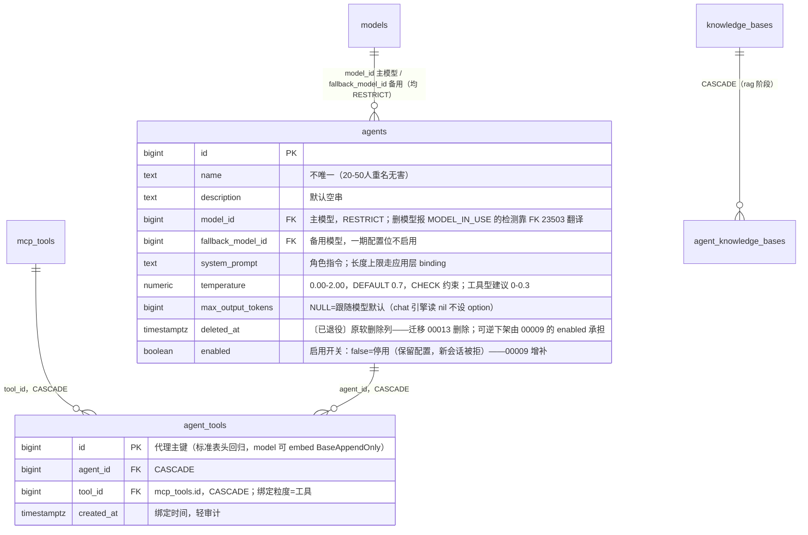

# Agent 模块数据模型（db_model）

> 状态：**数据模型已定稿并落库**（2026-08-20）：00004_kb_agents.sql 编辑后重新应用（agents 增 `max_output_tokens` + temperature CHECK；`agent_mcp_tools` 更名 `agent_tools`，代理 id 主键 + uq），`docs/design/data-model.md` 与 CLAUDE.md 索引地图已同步。契约层（api/）与业务层尚未开建；`agent_knowledge_bases` 按用户决定留到 rag 阶段再议，本期 CRUD 不碰。
> 本文记录 agent 模块数据模型的最终结论与决策理由（2026-08-20 三轮评审收敛）；表归属总览见 [docs/design/data-model.md](../../design/data-model.md)，建表通用规范见 CLAUDE.md《数据库规范》。

## 1. 实体关系

```
agents (1)
  ├── agent_tools (N)           绑定的 MCP 工具（多对多，绑定=授权）
  ├── agent_knowledge_bases (N) 关联知识库（多对多，rag 阶段启用，本期不碰）
  └── conversations (N)         历史会话（chat 模块，RESTRICT 拦硬删）
```



索引：`uq_agent_tools(agent_id, tool_id)` 防重复绑定 + 最左前缀覆盖按 agent 查询；`idx_agent_tools_tool` 反查"某工具被哪些 Agent 绑"（复合唯一覆盖不了单列查询，不冗余）；`idx_agents_model` / `idx_agents_fallback_model`（排障与未来反查）；`idx_agents_active` partial（活跃列表）〔已退役：其 partial 谓词引用 deleted_at，随迁移 00013 DROP COLUMN 被 PG 依赖级联自动删除〕。

## 2. 关键决策（三轮评审收敛，勿回头）

| # | 决策 | 理由 / 拒绝的备选 |
|---|---|---|
| 1 | 模型参数打散列（temperature + max_output_tokens），不用 jsonb | 暴露旋钮仅 2-3 个，强类型 + CHECK 可查可校验；jsonb 万金轮 = ext 垃圾场 |
| 2 | `max_output_tokens bigint NULL`，不用 `NOT NULL DEFAULT 2048` | NULL=跟随模型默认最诚实；硬默认会静默截断长输出 |
| 3 | **不存 `max_context_turns`** | 上下文组装归 chat 引擎（token 预算实现，轮数不可靠）；加列便宜、撤已发布配置难 |
| 4 | 不加 `enabled` 列 | 软删已覆盖下架；"临时停用可恢复"不是一期真需求。〔2026-08 后被推翻：迁移 00009 增补 `enabled`（停用 = 保留配置 + 新会话被拒）〕 |
| 5 | `name` 不唯一 | 跟随 CLAUDE.md 索引地图；普通唯一 + 软删 = 删掉的行占名。〔软删已退役（迁移 00013），本条顾虑不复存在〕 |
| 6 | **绑定粒度 = 工具，不是 server** | 绑定即授权，授权到能力本身；绑 server 则新 discover 的工具自动获得授权（无人审批）+ 提示词全量注入膨胀。拒绝 agents 上加 jsonb 权限字段——那是劣化版绑 tool（名字漂移、无反查、无审计） |
| 7 | `agent_tools` 用代理 id 主键 + uq | 用户拍板；标准表头（每表必备 id）回归，model 可 embed `db.BaseAppendOnly` |
| 8 | ReAct 迭代上限**不进 DB** | chat 引擎常量（默认 8 轮工具调用），触发后优雅收尾（"请基于以上信息作答"），executions 记 finish_reason=max_iterations；用户不知该填几，不暴露成产品配置 |
| 9 | 软删除而非硬删 | conversations.agent_id RESTRICT 拦硬删——带历史的 Agent 永远硬删不掉；软删后绑定行保留（CASCADE 只在硬删触发），恢复时绑定还在。**〔2026-09-14 修订（用户批准）：软删退役（迁移 00013）**——DELETE = 真删（绑定行 FK CASCADE 清理）；有历史会话时 FK RESTRICT 23503 → `agentapi.ErrAgentInUse`(409) 挡删；可逆下架由既有 `enabled` 承担（停用 = 新会话被拒，一键恢复）；误删兜底 = PG 每日备份〕 |

## 3. 与 mcp / chat 的运行时契约（后续模块实现时对照）

- **mcp discover 必须走 upsert**：按 `uq_mcp_tools_server_name` ON CONFLICT 更新 description / input_schema，id 稳定、绑定不漂移；**禁止 delete + 重插**（id 变 → CASCADE 静默清光绑定）。discover 返回 diff（added/removed/changed），removed 项带被绑 Agent 数警告；拒绝"同 schema 视为改名保 id"的启发式（误绑风险）。
- **工具 name 变更 = 删旧增新**：旧绑定被 CASCADE 清掉是语义正确（改名后是否同一能力、是否继承授权，机器判不了），由 discover diff 报告让运维可见、重新勾选。
- **chat 引擎组装提示词**：工具元数据读库（mcp_tools 即 list_tools 缓存），一条 JOIN 读绑定工具，不实时 list_tools；LLM 运行时工具名 = 清洗后的 `server__tool`（≤64 字符），会话内维护映射表，回叫用原始 name 调 tools/call。
- **provider 删模型撞 agent 引用**：FK RESTRICT 报 23503 → provider service 翻译 `ErrModelInUse`（409）——FK 就是检测机制，不反查他模块表。

## 4. 边界决策（2026-08-20 用户拍板）

1. **`tool_ids` 存在性校验 = FK 23503 翻译**：插入 agent_tools 撞不存在工具直接触发 FK 报错，service 捕获翻译哨兵；零依赖、不被 mcp 模块进度阻塞，mcp 建成后可加前置校验、FK 永远兜底。
2. **本期就接 Cache-Aside**：Get 走 `hify:agent:{id}`（TTL 30min），Update/Delete 事务提交后删 key；读侧消费者 chat 建成即用。
3. **绑定提交 = 主资源 body 内嵌 `tool_ids`**：POST/PUT 整体提交，事务内先删后插；独立子路由留到有局部改绑定需求时再加。
4. **model_name 前端本地映射**：后端只回 `model_id`，展示名由前端用 providers/models 目录映射。
