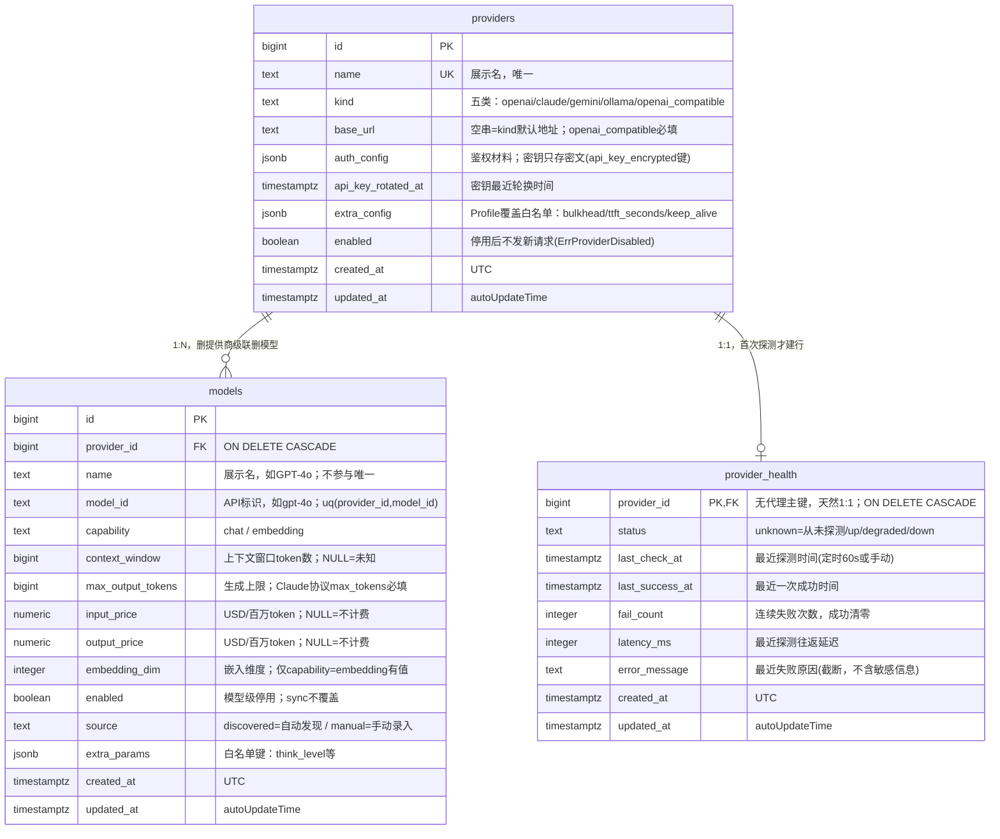

# Provider 模块数据模型（db_model）

> 状态：**已落地数据层、契约层、CRUD 全链路、连通性探测、定时探测、handler 路由、组合根接线与模型同步**（2026-08-19）：00002 最终态三张表 + `provider/api/`（schema / 接口 / 哨兵 / 测试）+ `service/crypto.go`（AES-256-GCM）+ `service/service.go`（ProviderService / ModelService CRUD、Cache-Aside 缓存、23505/23503 翻译）+ `service/prober.go`（kind 分发探测 + DEGRADED 状态机 + StartProber 定时轮）+ `service/sync.go`（SyncModels 真实实现：5 kind 直连解析 + 只增改不删 upsert）+ `store/store.go`（GORM 15 方法含 UpsertHealth，sqlmock 测试绿）+ handler 12 端点 + 组合根接线（graceful shutdown + `go prober.StartProber(appCtx)`）均已就位；主密钥经 `config.ProviderCfg`（`PROVIDER_MASTER_KEY`，启动缺失 fail-fast）。探测设计要点：detail 缓存载荷**剔除 health**（探测写库不失效缓存，Get 现读 provider_health 单行填充）；解密失败（主密钥轮换后旧密文）不发请求、不动 health，以失败结果返回。接线与 sync 设计见 [wiring_sync_spec.md](wiring_sync_spec.md)，人工冒烟步骤见 [docs/testing/provider-manual-test.md](../../testing/provider-manual-test.md)。
> 本文记录 provider 模块数据模型的最终结论、决策理由与相关约定；表归属总览见 [docs/design/data-model.md](../../design/data-model.md)，建表通用规范见 CLAUDE.md《数据库规范》。

## 1. 实体关系

```
provider (1)
  ├── auth_config: JSON         鉴权材料，结构随 kind 变化（密钥值级加密）
  ├── models (N)                该供应商下的所有模型
  │     └── extra_params: JSON  模型级扩展参数（think_level 等）
  └── provider_health (1)       健康状态，探测高频更新独立成表（不搅动配置缓存）
```



三张表分工（写频率 = 是否进 Cache-Aside 缓存的依据）：

| 表 | 角色 | 写频率 | 缓存 |
|---|---|---|---|
| `providers` | 配置与凭证 | 低（人工操作） | 是 |
| `models` | 模型目录与计价 | 低（sync / 人工） | 是 |
| `provider_health` | 探测结果 | 高（定时探测每轮写） | **否**（独立表的意义：探测写不触发 providers/models 的缓存删 key） |

## 2. 设计决策记录

### 2.1 鉴权差异怎么统一存储

**决策：鉴权"方式"由 kind 派生，不落库；每行只存"材料"，集中在 `auth_config jsonb`。**

| kind | 默认 base_url（代码常量表） | auth_config 形状 | 鉴权 header（eino adapter 内定） |
|---|---|---|---|
| `openai` | `https://api.openai.com/v1` | `{"api_key_encrypted": "…"}`（必填） | `Authorization: Bearer` |
| `claude` | `https://api.anthropic.com` | `{"api_key_encrypted": "…"}`（必填） | `x-api-key` + `anthropic-version` |
| `gemini` | `https://generativelanguage.googleapis.com` | `{"api_key_encrypted": "…"}`（必填） | `x-goog-api-key` |
| `ollama` | `http://localhost:11434` | `{}` | 无 |
| `openai_compatible` | 无（base_url 必填，service 校验） | `{"api_key_encrypted": "…"}`（可省略） | `Bearer`（无 key 不带） |

- **不设独立 `auth_type` 列**：鉴权方式与协议强绑定（kind=claude 必然是 x-api-key），拆开会产生非法组合；将来接 OAuth 型供应商（Bedrock/Vertex）再加。
- **`base_url` 对每类都可覆盖**（空串 = 默认）：国内直连前三家普遍走自建网关，这是刚需。
- `openai_compatible` 是第五类通用类型（讨论增补）：复用 OpenAI 协议 adapter + 自定义 base_url，零成本覆盖 DeepSeek / Qwen / Kimi / vLLM / OpenRouter 等长尾。

**加密约定（安全底线）：**

- 密钥**只存密文**：`api_key_encrypted` 键的值 = `base64(AES-256-GCM nonce‖ciphertext)`；jsonb 其余键明文。写边界收到明文 key → service 加密后组装；service 校验拒绝明文密钥键入库。
- 主密钥来自 env `PROVIDER_MASTER_KEY`（32B base64），启动缺失 fail-fast；轮换主密钥 = 离线重加密任务（一期不做）。
- 明文 key 只存在于两个瞬间：写入前、构造 LLM 调用时（解密发生在 provider service 边界）。不进日志、不进 schema JSON、不进 executions。
- UI 展示：list 给 `has_api_key`，详情给 `api_key_masked`（解密后打码 `sk-****abcd`）。
- `api_key_rotated_at` 记录最近轮换时间。

### 2.2 一个供应商下多个模型怎么管理

**决策：双源管理（自动发现 + 手动录入），`source` 列区分，sync 只增改不删。**

- 发现：`POST /providers/{id}/models/sync`——openai/claude/gemini 走 `GET /models`，ollama 走 `GET /api/tags`（端点差异 service 抹平），按 `(provider_id, model_id)` upsert，`source='discovered'`。
- 手动：`openai_compatible` 无可靠发现端点，全部手动添加，`source='manual'`。
- **sync 语义**：只新增行、刷新元数据；绝不覆盖价格 / enabled / display_name / extra_params（发现端点不返回这些，手编数据是唯一事实源）；绝不删行——下线模型用 `enabled=false`。

**列命名（按业界惯例，用户决策）：`name` = 展示名（`GPT-4o`），`model_id` = 调用时传给 API 的标识（`gpt-4o`）。** 唯一约束 `(provider_id, model_id)`；name 不参与唯一性。

> ⚠️ 撞名提醒：`agents.model_id` / `agents.fallback_model_id` / `knowledge_bases.embedding_model_id` / `executions.model_id`（00004 / 00007）都是**指向 `models.id` 的外键**，与 models 表内 `model_id`（API 字符串）语义不同。JOIN 形如 `ON a.model_id = m.id` 后取 `m.model_id`，两侧 COMMENT 已写明。

**表名沿用 `models`（而非 `model_config`）**：00004_kb_agents / 00007_executions 的外键已指向 `models (id)`，data-model.md 的关系图同；改名需联动三处迁移，收益仅是命名偏好。

每列的确定消费者（无预留字段）：

| 列 | 消费方 |
|---|---|
| `capability` chat/embedding | agents 绑 chat 模型、knowledge_bases 绑 embedding 模型 |
| `context_window` | chat 引擎多轮上下文裁剪；NULL = 未知 |
| `max_output_tokens` | Claude 协议 `max_tokens` 必填 |
| `input_price` / `output_price`（USD/1M token，NULL = 不计费） | `platform/budget` 成本护栏 token→钱换算 |
| `embedding_dim`（仅 embedding 行） | rag 建 KB 校验维度；`vector(维度)` 建后不可改 |
| `enabled` | 模型级停用（发现会拉回上百个模型，只留常用的） |
| `source` | sync upsert 语义依据 |
| `extra_params` | 模型级参数白名单：`think_level`（思考档位，chat 引擎读默认值）等 |

**FK 语义：`models.provider_id` `ON DELETE CASCADE`**（models 离开 provider 无意义，真子表）。在用的模型仍删不掉——`agents.model_id` 的 RESTRICT 挡住级联并报错提示先解绑，是预期行为。

### 2.3 供应商健康状态怎么表示

**决策：三层拆分，前两层落库，运行时不落库。**

| 层 | 含义 | 存哪 | 变更时机 |
|---|---|---|---|
| 意图：`providers.enabled` | 管理员开关（停用 = 不发新请求，返回 `ErrProviderDisabled`） | providers 表 | 人为操作 |
| 探测：`provider_health` | 定时探测 + 手动 test-connection 的结果 | 独立表（1:1） | 每轮探测 / 手动触发 |
| 运行时：熔断状态、bulkhead 占用、503 率 | 秒级翻转的进程内状态 | **不落库**：platform/llm 内存（gobreaker）+ 结构化日志 | 每次 LLM 调用 |

运行时不落库理由：进程内存态、秒级翻转，写 PG 徒增写入且必 stale-on-read；一期观测走结构化日志（503 率统计），后期 Prometheus。

**`provider_health` 独立成表**（用户提议，采纳理由强于平铺在 providers 上的方案）：providers/models 是 Cache-Aside 缓存对象（TTL 30min + 写时删 key），健康字段平铺会导致每次探测都打爆配置缓存失效；独立表从根上隔离写热点。PK 即 `provider_id`（无代理主键，天然强制 1:1），行惰性 UPSERT 产生。

**DEGRADED 状态机**（一期即有定时探测，DEGRADED 有明确生产规则）：

| 探测结果 | 状态转移 |
|---|---|
| 成功且 latency ≤ 3s | `up`；fail_count 清零，刷新 last_success_at |
| 成功但 latency > 3s | `degraded`（慢） |
| 失败 | fail_count+1：≥3 → `down`；不足 3 → `degraded`（防抖动） |
| 从未探测 | `unknown` |

阈值（slow = 3s、fail = 3 次）先做包内常量，需要再提 env。

**定时探测运行时形态**：service 内 `StartProber(ctx)`——`app.Run` 启动、随 ctx 优雅退出；默认 60s 一轮；只探 `enabled=true`；每 provider 一个 goroutine（个位数量级）+ 复用 10s 探测超时（probeTimeout，单 client 单代码路径）；探测是直连 HTTP 轻量调用，**不走 eino、不占 bulkhead、不触发熔断**（与 platform/llm 运行时状态互不干扰）；翻转为 `down` 打 WARN 日志。探测端点按 kind：openai/claude/gemini → `GET /models`，ollama → `GET /api/tags`，openai_compatible → `GET {base_url}/models`（结果分类：2xx/429 = 成功，401/403 = 鉴权失败，其余 = 失败；404 特例后续按需细化）。

### 2.3.1 定时探测落地 spec（StartProber，2026-08-18 定）

> 需求澄清结论（已交互确认）：复用 DEGRADED 状态机——慢成功（2xx 但 latency > 3s）记 `degraded`，**非 up**；失败不足 3 次也记 `degraded`（防抖动）。范围仅 service 层 + 测试，组合根接线留 TODO。探测超时复用 10s（probeTimeout），上文「5s」为落地前的过时值，已更正。

**Java 概念 → Go 映射**（对齐现有实现，无新建机制）：

| Java | Go |
|---|---|
| `@Scheduled(fixedRate=60s)` | `time.Ticker` + goroutine + `select ctx.Done()` |
| `asyncExecutor` 线程池 | 每 provider 一个 goroutine（个位数量级；goroutine 代价≈0，无需线程池） |
| 「不阻塞主线程」 | 组合根 `go func` 启动 `StartProber`，主 goroutine 继续跑 gin |

**代码结构（全部在 `internal/provider/service/`，prober.go 为主）**：

1. **抽 `probeOne(ctx, p *Provider) (*providerapi.ConnectionTestSchema, error)`**——把 `TestConnection` 的「解密 → probe → WithTx(锁读 → applyProbeResult → UpsertHealth)」核心体抽出；`TestConnection` 与 `runProbeRound` 共用同一探测写库逻辑，避免定时路径二次 `GetProviderByID`。`TestConnection` 瘦身为 validate → GetProviderByID → probeOne，行为不变（既有用例全绿）。

2. **down 翻转 WARN**（§2.3 已定）：`probeOne` 内锁读后比较 `old.Status` 与 `applyProbeResult` 结果，`old.Status != down && new == down` 时 `slog.WarnContext(ctx, ..., "provider_id", p.ID, "latency", ...)`。手动与定时共用，语义一致。

3. **`StartProber(ctx)`（concrete 方法，不进 `providerapi.ProviderService` 接口）**：`time.NewTicker(s.interval)` 循环，`select { <-ctx.Done() → return; <-t.C → runProbeRound(ctx) }`，`defer t.Stop()`。生命周期接缝在接线批次解决（见下方「接线注记」）。

4. **`runProbeRound(ctx)`（同步方法，测试直调，不依赖真实 ticker）**：`ListProviders` → 过滤 `Enabled` → 每 provider 一个 goroutine 调 `probeOne`（`sync.WaitGroup` 收尾）→ `probeOne` 返回 err 时 `slog.ErrorContext`。

5. **常量**：`probeInterval = time.Minute`（包内常量，与其余探测阈值一致「暂不进配置」）；`providerService` 增 `interval time.Duration` 字段，`NewProviderService` 默认 `probeInterval`，测试注入短间隔。

6. **并发安全**：`*http.Client` 并发安全（`s.probe` 跨 goroutine 共享）；`applyProbeResult` 纯函数 + `WithTx` 内 `FOR UPDATE` 已串行化 fail_count 读改写（§2.3 既有机制，定时路径直接继承）；`time.Ticker` 消费端忙时丢 tick（channel 缓冲 1），单轮 10s 上界 << 60s 间隔，无重叠。

7. **解密失败**（主密钥轮换后的旧密文）沿用 `TestConnection` 语义：不发请求、不写 health，`slog.Warn` + 返回失败 schema；定时路径同样不把配置错误记成 down。

**接线注记**：`NewProviderService` 现返回 `providerapi.ProviderService`（接口），`StartProber` 在未导出的 concrete 类型上，组合根拿不到。接线批次二选一：定义窄接口 `type Prober interface{ StartProber(ctx context.Context) }` 让 New 返回 `(providerapi.ProviderService, Prober)`，或组合根持有导出 concrete 类型。本批次只在 `internal/app/server.go` 的 provider 装配块留 TODO 注释说明，不实现。

**测试（`prober_test.go` / `provider_service_test.go` 增补，覆盖率 ≥80%）**：

- `runProbeRound` 只探 enabled（seed 2 enabled + 1 disabled，断言 `upsertHealthCalls == 2`）
- `runProbeRound` 探测成功写 health（httptest 桩，断言 memStore.healths 状态 up / latency 落列）
- `StartProber` 预取消 ctx 立即返回（优雅关闭路径）
- `StartProber` 注入短 interval（10ms）触发 ≥1 轮后取消
- `probeOne` 抽离后 `TestConnection` 既有用例全绿（行为不变）

### 2.4 方言与通用约定（对照 MySQL 写法）

本项目 PG 17，照抄 MySQL 规范会写错（详见 CLAUDE.md《与 MySQL 规范的取舍说明》）。本次讨论中出现的 MySQL 写法 → 最终采用：

| 讨论中出现 | 最终采用 |
|---|---|
| `AUTO_INCREMENT` | `bigint GENERATED ALWAYS AS IDENTITY` |
| `VARCHAR(N)` | `text` |
| `TINYINT` 代布尔 / `deleted` 软删除 | `boolean`；软删除仅 agents/documents（软删行仍占 name 唯一键，重建同名会 409） |
| `DATETIME` | `timestamptz`（UTC） |
| `JSON` | `jsonb` |
| 行内 `COMMENT` | `COMMENT ON` |
| 大写枚举值 / `ANTHROPIC` | 小写 `claude`（与 00002、eino 命名一致）；补齐遗漏的 `gemini` |

## 3. 最终 DDL（重写 migrations/00002_provider.sql）

```sql
-- +goose Up
-- providers：模型提供商配置（provider 模块）；健康状态在 provider_health，不混本表（缓存隔离）
CREATE TABLE providers (
    id                 bigint GENERATED ALWAYS AS IDENTITY PRIMARY KEY,
    name               text NOT NULL,
    kind               text NOT NULL
                       CHECK (kind IN ('openai', 'claude', 'gemini', 'ollama', 'openai_compatible')),
    base_url           text NOT NULL DEFAULT '',
    auth_config        jsonb NOT NULL DEFAULT '{}'::jsonb,
    api_key_rotated_at timestamptz,
    extra_config       jsonb NOT NULL DEFAULT '{}'::jsonb,
    enabled            boolean NOT NULL DEFAULT true,
    created_at         timestamptz NOT NULL DEFAULT now(),
    updated_at         timestamptz NOT NULL DEFAULT now()
);
CREATE UNIQUE INDEX uq_providers_name ON providers (name);

COMMENT ON TABLE  providers IS '模型提供商配置：五类统一接入；本表低频写，是 Cache-Aside 缓存对象';
COMMENT ON COLUMN providers.kind IS 'openai/claude/gemini/ollama/openai_compatible；鉴权方式与默认端点由 kind 派生';
COMMENT ON COLUMN providers.base_url IS 'API 地址；空串 = kind 默认地址（代码常量表）；openai_compatible 必填（service 校验）';
COMMENT ON COLUMN providers.auth_config IS '鉴权材料：键白名单，密钥只存密文 {"api_key_encrypted": "base64(AES-256-GCM)"}；ollama 为 {}';
COMMENT ON COLUMN providers.api_key_rotated_at IS '密钥最近一次轮换时间';
COMMENT ON COLUMN providers.extra_config IS 'Profile 覆盖与连接差异，白名单键：bulkhead / ttft_seconds / keep_alive(仅 ollama)';

-- models：提供商下的模型
CREATE TABLE models (
    id                bigint GENERATED ALWAYS AS IDENTITY PRIMARY KEY,
    provider_id       bigint NOT NULL REFERENCES providers (id) ON DELETE CASCADE,
    name              text NOT NULL,
    model_id          text NOT NULL,
    capability        text NOT NULL CHECK (capability IN ('chat', 'embedding')),
    context_window    bigint,
    max_output_tokens bigint,
    input_price       numeric(12,4),
    output_price      numeric(12,4),
    embedding_dim     integer,
    enabled           boolean NOT NULL DEFAULT true,
    source            text NOT NULL DEFAULT 'manual' CHECK (source IN ('discovered', 'manual')),
    extra_params      jsonb NOT NULL DEFAULT '{}'::jsonb,
    created_at        timestamptz NOT NULL DEFAULT now(),
    updated_at        timestamptz NOT NULL DEFAULT now()
);
CREATE UNIQUE INDEX uq_models_provider_model_id ON models (provider_id, model_id);
-- 按提供商查模型走 uq 最左前缀，不另建单列索引

COMMENT ON TABLE  models IS '提供商下的模型：chat 供对话/工作流，embedding 供 RAG 向量化';
COMMENT ON COLUMN models.name IS '展示名，如 GPT-4o；不参与唯一性';
COMMENT ON COLUMN models.model_id IS '调用时传给 API 的标识，如 gpt-4o；注意 agents.model_id 等外键指向本表 id，与本品列语义不同';
COMMENT ON COLUMN models.capability IS '能力类型：chat / embedding';
COMMENT ON COLUMN models.context_window IS '上下文窗口（token）；NULL = 未知';
COMMENT ON COLUMN models.max_output_tokens IS '单次生成上限（token）；Claude 协议 max_tokens 必填';
COMMENT ON COLUMN models.input_price IS '输入价（USD/百万 token）；NULL = 不计费（本地/未配置），budget 护栏换算用';
COMMENT ON COLUMN models.output_price IS '输出价（USD/百万 token）；NULL = 不计费';
COMMENT ON COLUMN models.embedding_dim IS '嵌入维度（仅 capability=embedding）；建 KB 校验，vector(维度) 不可改';
COMMENT ON COLUMN models.enabled IS '模型级停用：发现拉回的冷门模型可停用，不影响已绑定 agent';
COMMENT ON COLUMN models.source IS 'discovered=自动发现（sync 只增改不删）/ manual=手动录入';
COMMENT ON COLUMN models.extra_params IS '模型级参数，白名单键：think_level（思考档位）等';

-- provider_health：供应商健康（1:1，探测写与配置缓存隔离；含定时探测）
CREATE TABLE provider_health (
    provider_id     bigint PRIMARY KEY REFERENCES providers (id) ON DELETE CASCADE,
    status          text NOT NULL DEFAULT 'unknown'
                    CHECK (status IN ('unknown', 'up', 'degraded', 'down')),
    last_check_at   timestamptz,
    last_success_at timestamptz,
    fail_count      integer NOT NULL DEFAULT 0,
    latency_ms      integer,
    error_message   text,
    created_at      timestamptz NOT NULL DEFAULT now(),
    updated_at      timestamptz NOT NULL DEFAULT now()
);

COMMENT ON TABLE  provider_health IS '探测结果（定时 + 手动）；熔断/槽位等运行时状态在 platform/llm 内存，不落库';
COMMENT ON COLUMN provider_health.status IS 'unknown=从未探测；up=正常；degraded=慢(>3s)或失败未达阈值；down=连续失败≥3';
COMMENT ON COLUMN provider_health.fail_count IS '连续探测失败次数，成功清零';

-- +goose Down
DROP TABLE IF EXISTS provider_health;
DROP TABLE IF EXISTS models;
DROP TABLE IF EXISTS providers;
```

> 迁移策略：新项目、无生产数据，**直接重写 00002 为最终态**（"迁移只增不改"的一次性豁免）；dev 库 `goose down` 归零后重跑。此后的演进恢复只增不改。

## 4. Go model（internal/provider/service/model.go）

```go
type Provider struct {
	db.BaseMutable // id + created_at + updated_at
	Name            string            `gorm:"not null"`
	Kind            string            `gorm:"not null"`
	BaseURL         string            // 空串 = kind 默认地址
	AuthConfig      map[string]string `gorm:"type:jsonb;serializer:json"` // 密文只出现在 api_key_encrypted 键
	APIKeyRotatedAt *time.Time
	ExtraConfig     map[string]any `gorm:"type:jsonb;serializer:json"` // bulkhead / ttft_seconds / keep_alive
	Enabled         bool           `gorm:"not null;default:true"`
}
func (Provider) TableName() string { return "providers" }

type Model struct {
	db.BaseMutable
	ProviderID      uint64 `gorm:"not null"`
	Name            string `gorm:"not null"` // 展示名
	ModelID         string `gorm:"not null"` // API 标识
	Capability      string `gorm:"not null"`
	ContextWindow   *int64
	MaxOutputTokens *int64
	InputPrice      *string        `gorm:"type:numeric(12,4)"` // 字符串金额经 pgx 文本协议直通 numeric，不引入 decimal 库
	OutputPrice     *string        `gorm:"type:numeric(12,4)"`
	EmbeddingDim    *int32
	Enabled         bool   `gorm:"not null;default:true"`
	Source          string `gorm:"not null;default:'manual'"`
	ExtraParams     map[string]any `gorm:"type:jsonb;serializer:json"` // think_level 等
}
func (Model) TableName() string { return "models" }

// ProviderHealth 无代理主键，不能 embed 带 id 的 mixin，自声明时间戳。
type ProviderHealth struct {
	ProviderID    uint64     `gorm:"primaryKey"`
	Status        string     // unknown / up / degraded / down
	LastCheckAt   *time.Time
	LastSuccessAt *time.Time
	FailCount     int32      `gorm:"not null;default:0"`
	LatencyMs     *int32
	ErrorMessage  string
	CreatedAt     time.Time
	UpdatedAt     time.Time `gorm:"autoUpdateTime"`
}
func (ProviderHealth) TableName() string { return "provider_health" }
```

## 5. api 层要点

- **ProviderSchema 永不含密文**：`has_api_key bool` + 详情 `api_key_masked`；`auth_config`/`extra_config`/`extra_params` 透出（密文字段除外）。
- **新增哨兵**（补进 api/errors.go 与 CLAUDE.md 错误码表）：`ErrModelNotFound`（404）、`ErrModelIDConflict`（409）、`ErrModelInUse`（409，删除被外键挡住）、`ErrProviderDisabled`（503）。
- **跨模块出口 RuntimeConfig**：chat / workflow 经 `providerapi` 取 `{kind, base_url, api_key(明文, json:"-"), model_id, profile_overrides}` 构造 platform/llm 调用——解密只在 provider service 边界，依赖方向 provider → platform 合法。
- 路由：`/providers` CRUD、`/providers/{id}/test-connection`、`/providers/{id}/models`、`/providers/{id}/models/sync`。

## 6. 落地顺序

1. 重写 `migrations/00002_provider.sql`（本文 §3）+ dev 库重置验证 ✅
2. `service/model.go`（本文 §4）+ `service/crypto.go`（AES-256-GCM 加解密与打码）✅
3. `api/`：接口、schema、哨兵 ✅
4. `store/` + `service/`：CRUD（✅ 2026-08-18：缓存失效矩阵、加密落库、双服务）、test-connection 状态机（✅ 2026-08-18：`service/prober.go` 探测引擎 + DEGRADED 转移 + UpsertHealth；detail 缓存剔除 health 改现读）、StartProber（✅ 2026-08-19：`StartProber`/`runProbeRound` 落地并过审查，接线见 §2.3.1 末注）、models sync（service 层占位 503，真实实现待 platform/llm 模型发现批次）
5. `handler/` 挂路由（spec 已定 [handler_spec.md](handler_spec.md)，待实现：12 端点含模型路由 + service 两处一行配套改）；组合根接线（与 StartProber 启动同批）；前端 ProviderList 对接（未做）
