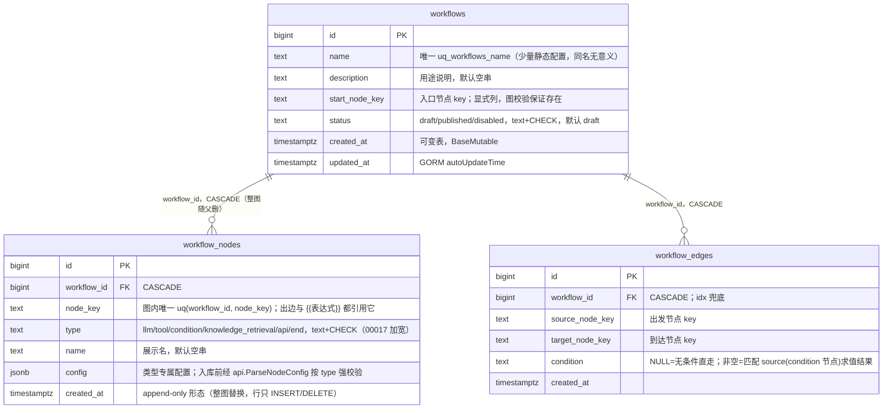

# Workflow 模块数据模型与设计（db_model）

> 状态：**设计定稿，未落库**（2026-09-15，四轮讨论收敛）：三表结构（workflows / workflow_nodes / workflow_edges）、分支语义（condition 节点求值 + 出边存匹配值）、status 三态（draft/published/disabled）均经用户拍板。迁移 `00016_workflow_schema.sql` 与 service model 已随 impl_spec_01 落地（2026-09-15，含 00006 旧单表替换修订，见 §3 注记）；2026-09-16 追加节点类型 `api` / `end`（迁移 `00017_workflow_node_type_widen.sql` 加宽 CHECK，见 §3/§4 注记与决策 #12）。api / store / handler 待 spec 02-04；全部落地后同步 [docs/design/data-model.md](../../design/data-model.md)、CLAUDE.md 索引地图与错误码表（新增 `WORKFLOW_NOT_PUBLISHED` / `WORKFLOW_NAME_CONFLICT`）。
> 本文记录 workflow 模块数据模型与核心设计的最终结论与决策理由；表归属总览见 data-model.md，建表通用规范见 CLAUDE.md《数据库规范》。

## 1. 概念模型：一份 DSL 拆三张表

简版工作流 = 线性 + 条件分支（CLAUDE.md 产品定位：JSON 配置，不做可视化拖拽编排）。一份 JSON DSL 拆开存——**创建时拆分写入，查询时组装还原**：

```
workflows        基本信息 + 入口 + 状态            "这份流程叫什么、从哪开始、能不能跑"
workflow_nodes   节点：干什么（type + config）     "意图识别 / 查订单 / 条件判断 / 知识检索"
workflow_edges   连线：做完去哪（source → target）  "识别完去判断；判断为真去查订单"
```

节点与连线是两个概念、两张表，职责互不重叠：节点只管"我干什么"，连线只管"做完去哪"。执行时加载两表进内存组装成 `map[node_key]Node` + `map[source][]Edge`，从入口 for 循环逐节点执行——存库是平铺两张表，执行是两个 Map + 一个循环，中间零魔法。

## 2. 实体关系



> `models` / `mcp_tools` / `knowledge_bases` 的引用藏在 `workflow_nodes.config` jsonb 内（`model_id` / `tool_id` / `knowledge_base_id`），**无 FK**——jsonb 列建不了外键，存在性由 service 保存时经下游模块 api 校验（决策 #9）。

索引：`uq_workflows_name`（业务唯一键）；`uq_workflow_nodes_wf_key(workflow_id, node_key)` 图内 key 唯一 + 最左前缀覆盖外键查询；`idx_workflow_edges_workflow_id`（外键必建索引；图极小，加载按 workflow_id 一次取全，无需按 source 单列索引）。

## 3. DDL 终稿（00016_workflow_schema.sql）

```sql
-- +goose Up
-- 工作流三表：一份 DSL 拆开存——基本信息 / 节点 / 连线；保存时拆写（事务内整图替换），加载时组装。
CREATE TABLE workflows (
    id             bigint      GENERATED ALWAYS AS IDENTITY PRIMARY KEY,
    name           text        NOT NULL,
    description    text        NOT NULL DEFAULT '',
    start_node_key text        NOT NULL,
    status         text        NOT NULL DEFAULT 'draft'
                    CHECK (status IN ('draft','published','disabled')),
    created_at     timestamptz NOT NULL DEFAULT now(),
    updated_at     timestamptz NOT NULL DEFAULT now()
);

CREATE UNIQUE INDEX uq_workflows_name ON workflows (name);

CREATE TABLE workflow_nodes (
    id          bigint      GENERATED ALWAYS AS IDENTITY PRIMARY KEY,
    workflow_id bigint      NOT NULL REFERENCES workflows(id) ON DELETE CASCADE,
    node_key    text        NOT NULL,
    type        text        NOT NULL CHECK (type IN ('llm','tool','condition','knowledge_retrieval')),
    name        text        NOT NULL DEFAULT '',
    config      jsonb       NOT NULL,
    created_at  timestamptz NOT NULL DEFAULT now()
);

-- node_key 图内唯一；出边与 {{表达式}} 都引用它；前导列 workflow_id 兼作外键索引
CREATE UNIQUE INDEX uq_workflow_nodes_wf_key ON workflow_nodes (workflow_id, node_key);

CREATE TABLE workflow_edges (
    id              bigint      GENERATED ALWAYS AS IDENTITY PRIMARY KEY,
    workflow_id     bigint      NOT NULL REFERENCES workflows(id) ON DELETE CASCADE,
    source_node_key text        NOT NULL,
    target_node_key text        NOT NULL,
    condition       text,
    created_at      timestamptz NOT NULL DEFAULT now()
);

CREATE INDEX idx_workflow_edges_workflow_id ON workflow_edges (workflow_id);

COMMENT ON TABLE  workflows IS '简版工作流（线性+条件分支）：基本信息+入口；节点/连线分表存，编辑=事务内整图替换';
COMMENT ON COLUMN workflows.start_node_key IS '入口节点 node_key，执行从此开始；保存时图校验保证存在';
COMMENT ON COLUMN workflows.status IS 'draft=新建未发布（不可执行）/ published=可执行 / disabled=停用（图保留，恢复再 publish）；编辑不降级（无版本化，改完即对新执行生效）';
COMMENT ON TABLE  workflow_nodes IS '节点一行一个；config 格式由 type 判别，入库前经 api.ParseNodeConfig 按 type 强校验，jsonb 只兜 JSON 语法';
COMMENT ON COLUMN workflow_nodes.config IS 'llm={model_id,prompt} / tool={tool_id,args} / condition={expression} / knowledge_retrieval={knowledge_base_id,top_k}；model_id 等引用存在性由 service 经下游 api 校验（jsonb 内无法建 FK）';
COMMENT ON TABLE  workflow_edges IS '连线：source→target；condition 非空=匹配 source(condition 节点)的求值结果，NULL=无条件直走';
COMMENT ON COLUMN workflow_edges.condition IS '分支匹配值（true/false/分类标签）；condition 节点出边必填、其余节点出边必 NULL（应用层校验）';

-- +goose Down
DROP TABLE IF EXISTS workflow_edges;
DROP TABLE IF EXISTS workflow_nodes;
DROP TABLE IF EXISTS workflows;
```

> 〔2026-09-15 修订（实施时用户拍板）：迁移 00006 已建旧单表 `workflows`（`config jsonb` 整图存储，即决策 #1 否决的形态），上方 `CREATE TABLE workflows` 会撞名。实际落盘的 00016 Up 在本 DDL 前增加 `DROP TABLE IF EXISTS workflows;`，Down 在删三表后按 00006 原样建回旧单表（对称回滚）。全仓无代码读写旧表、无 FK 指向它，替换零风险。〕
>
> 〔2026-09-16 追加（用户拍板）：节点类型加宽——新增 `api`（直接 HTTP 调用）与 `end`（显式终止，可选）。迁移 `00017_workflow_node_type_widen.sql` 把上方 inline CHECK（PG 自动名 `workflow_nodes_type_check`）替换为六值版本并同步 `config` 列 COMMENT；00016 文件不改（迁移只增不改）。〕

## 4. 节点类型与 config 格式

| type | 语义 | config 字段 | 执行时走哪 |
|---|---|---|---|
| `llm` | 单轮 LLM 调用（无多轮上下文，工作流节点不需要对话引擎） | `model_id`、`prompt`、`temperature?` | `platform/llm`（**不经 chat**，依赖规则：workflow 不得为执行节点依赖 chat） |
| `tool` | MCP 工具调用 | `tool_id`、`args?`（值支持 `{{var}}` 模板） | mcp 模块 api |
| `condition` | 表达式求值，结果字符串供出边匹配 | `expression` | 纯内存求值，零外部调用 |
| `knowledge_retrieval` | 知识库检索（结果注入上下文） | `knowledge_base_id`、`top_k?` | rag 模块 api |
| `api` | 直接 HTTP 调用（不经 MCP 注册的轻量出站请求） | `url`、`method`（GET/POST/PUT/DELETE/PATCH）、`headers?`、`body?`、`timeout_sec?`（0=默认 10s，1-60）、`ssl_verify?`（默认 false = 跳过证书校验，内网自签端点） | 执行器 `callApi`（SSRF 防护与 TLS 配置归执行器，spec 05） |
| `end` | 显式终止节点（**可选**，2026-09-16 拍板）：`output` 模板拼工作流终稿，空 = 取最后执行节点输出 | `output?` | 执行器 `buildOutput`，零外部调用 |

```jsonc
// config 按类型各异，存同一 jsonb 列（判别字段 = 同行 type 列）
{ "model_id": "3", "prompt": "判断用户意图，只输出 ORDER_QUERY 或 POLICY_QUERY：{{input}}", "temperature": 0 }
{ "tool_id": "12", "args": { "order_id": "{{input.order_id}}" } }
{ "expression": "{{classify}} == 'ORDER_QUERY'" }
{ "knowledge_base_id": "7", "top_k": 3 }
{ "url": "https://api.example.com/orders", "method": "POST", "headers": { "X-Request-Id": "{{input.req_id}}" }, "body": "{\"id\":\"{{input.id}}\"}", "timeout_sec": 30, "ssl_verify": true }
{ "output": "回复：{{reply}}" }
```

模板变量：`{{input}}` = 工作流输入；`` = 该节点的输出（执行上下文按 node_key 存每个节点的产出，condition 求值结果同样以 node_key 落上下文，后续节点可复用）。

## 5. 关键决策（四轮收敛，勿回头）

| # | 决策 | 理由 / 拒绝的备选 |
|---|---|---|
| 1 | **三表拆分**（workflows / nodes / edges） | 节点/连线两概念与存储一一对应；key 唯一、type CHECK、外键索引由 DB 兜底。拒绝单表存整图 jsonb blob——DB 级约束全失去、图校验全压应用层；拒绝每类型一表——UNION 加载、表爆炸，一人维护犯不上 |
| 2 | **连线引用 node_key 字符串，不引用 bigint 主键** | 用户拍板：key 由业务逻辑决定（classify / router），前端或 JSON 手写时先有 key 后落库、不依赖自增顺序；条件表达式 `{{classify}}` 也引用 key——key 是图语义，id 是存储细节 |
| 3 | **config 用 jsonb 单列 + type 判别，不拆列不拆表** | 判断标准：字段结构不确定、记录间差异大 → JSON；结构固定、要按字段查询 → 拆列。加节点类型 = 改 CHECK + 加 ParseNodeConfig case，近零 DDL |
| 4 | **分支语义 = condition 节点求值一次 + 出边存匹配值** | 用户拍板（与其白板图一致）。表达式只在节点处求值一次、结果落上下文可复用；校验黑白分明（condition 出边必填、其余必 NULL）。拒绝"边带表达式"——任意出边可带条件、求值顺序敏感，误配置难在校验期暴露；Dify/n8n 分支皆节点化，将来上画布 1:1 映射 |
| 5 | **status 三态 draft/published/disabled**（text+CHECK） | 用户拍板（推翻最初 enabled 布尔方案）：Dify 式发布心智，draft = 新建后、首次发布前的暂存态 |
| 6 | **编辑不降级**：PUT 整图替换不改 status | 无版本化（明确不做 Dify 双版本存储），编辑若自动回 draft = "线上无可用版本"窗口 + 忘记重新发布事故；改完即对新执行生效，进行中执行用启动时快照 |
| 7 | **start_node_key 显式列** | 拒绝"无入边节点即入口"的隐式推导——显式可读可校验，引擎不猜 |
| 8 | **保存 = 事务内整图替换**（DELETE + 批量 INSERT，多 VALUES） | 图是整体语义，行级 diff 难写易留脏数据；nodes/edges 因此是 append-only 形态（无 updated_at，行只 INSERT/DELETE），model embed `db.BaseAppendOnly` |
| 9 | **jsonb 内引用存在性由 service 经下游 api 校验** | jsonb 列建不了 FK；保存路径顺路校验（model_id→provider、knowledge_base_id→rag）。拒绝把 id 提升为可空真列换 FK——半数节点类型用不上，稀疏列违反"列尽量 NOT NULL"。〔2026-09-15 修订（用户拍板）：tool_id 推迟到执行器 fail-fast——mcp api 未建且 jsonb 无 FK 兜底（agent 模块靠真列 FK 23503 的路径对 jsonb 不存在），mcp 建成后回补保存期预检〕 |
| 10 | **name 唯一**（uq_workflows_name） | 少量静态配置、同名无意义；与 providers/users 同组（CLAUDE.md 索引地图"PK + 业务唯一键"）。与 agents"不唯一"的差异：工作流被 JSON/对话按名引用的场景更近，保留辨识度 |
| 11 | **节点 ≤ 50、连线 ≤ 100**（binding 封顶） | 防巨图拖垮校验与执行；一期线性+分支用不到更多 |
| 12 | **节点类型加宽 `api` / `end`**（2026-09-16 拍板） | `api`：一次性出站调用不值得注册 MCP——url/method/headers/body/timeout_sec/ssl_verify 完整版字段，SSRF 防护与 TLS 配置归执行器；`ssl_verify` 默认 **false**（跳过证书校验）——内网自签端点是主要场景，显式默认值换配置省心，风险已知悉。`end`：显式终止 + `output` 模板（`buildOutput`），**可选不强求**——无出边 = 隐式结束的既有语义保留（向后兼容，既有图零改动），但 end 节点本身禁出边（§7 条 10）。拒绝「强制每图必有 end」：破坏既有图与示例，收益仅是显式性 |

## 6. 状态机与生命周期

| 动作 | 迁移 | 说明 |
|---|---|---|
| 新建（POST） | → `draft` | 默认态；可编辑、不可执行 |
| `POST /workflows/{id}/publish` | `draft` / `disabled` → `published` | 唯一进入可执行态的动作；图校验在每次保存时已过，publish 是纯状态翻转（已 published 再 publish 幂等成功） |
| `POST /workflows/{id}/disable` | `published` → `disabled` | 运维暂停；图原样保留，再 publish 即恢复 |
| 编辑（PUT 整图） | **不变** | 见决策 #6 |
| execute | 仅 `published` | 其余态 → `workflowapi.ErrWorkflowNotPublished`（503，文案区分 draft/disabled） |

draft 的真实语义收窄为：**新建后、首次发布前**的暂存态（决策 #6 之下不存在"改已发布流程先存草稿"的路径）。

## 7. 保存模型：整图提交 + 图校验

```
POST/PUT /workflows  {name, start_node_key, nodes[], edges[]}
  → service：图校验（全过才动库）
  → WithTx:
      UPSERT workflows                  -- 基本信息（POST 插入 / PUT 更新）
      DELETE workflow_nodes  WHERE workflow_id = $1
      DELETE workflow_edges  WHERE workflow_id = $1
      批量 INSERT nodes / edges         -- 多 VALUES，禁循环单行
```

图校验清单（service 层，任一不过 → `VALIDATION_FAILED` 400，details 带节点 key 定位）：

1. 逐节点 config 经 `api.ParseNodeConfig` 强校验（未知 type / 字段非法 / 缺必填全拒）；
2. `start_node_key` 在节点集合内；
3. 每条边 source / target 指向本图存在的节点；
4. condition 节点出边 `condition` 必填，其余节点出边必须 NULL；
5. 非 condition 节点出边 ≤ 1（一期无并行分支）；
6. 无环：从入口沿连线遍历打标记，重访即拒绝；
7. 无不可达节点（存在但入口走不到 = 脏配置，早暴露）；
8. 节点 1..50、边 0..100（binding 封顶）；
9. jsonb 内引用存在性经下游 api 校验：model_id→provider、knowledge_base_id→rag；tool_id 推迟到执行器（决策 #9 修订，mcp api 未建）。
10. end 节点不得有出边（显式终止；不强制每图必有 end——无出边 = 隐式结束仍合法，决策 #12）。

## 8. Go 类型安全解析

jsonb 无类型，**类型安全由 Go 建立**：契约层密封接口 → 按 type 分发解析 → 引擎 type switch 消费。

```go
// workflow/api/schema.go —— 各类型 config 一份强类型 struct，密封接口封闭实现集
type NodeConfig interface{ isNodeConfig() }

type LLMConfig struct {
    ModelID     uint64  `json:"model_id,string"` // models.id，保存时经 provider api 校验
    Prompt      string  `json:"prompt"`
    Temperature float64 `json:"temperature,omitempty"` // 0 = 跟随模型默认
}
func (LLMConfig) isNodeConfig() {}
// ToolConfig{ToolID, Args map[string]string} / ConditionConfig{Expression}
// / KnowledgeRetrievalConfig{KnowledgeBaseID, TopK} 同构，略
// ApiCallConfig{URL, Method, Headers map[string]string, Body, TimeoutSec}
// / EndConfig{Output} 同构（00017 加宽，2026-09-16 拍板），略

// ParseNodeConfig 按 type 把 config 原始 JSON 解析为强类型；保存与加载共用同一入口。
// 未知类型、字段错误都进不了库；各类型跨字段规则走 cfg.Validate()。
func ParseNodeConfig(t NodeType, raw json.RawMessage) (NodeConfig, error) {
    var cfg NodeConfig
    switch t {
    case NodeLLM:
        cfg = LLMConfig{}
    case NodeTool:
        cfg = ToolConfig{}
    case NodeCondition:
        cfg = ConditionConfig{}
    case NodeKnowledgeRetrieval:
        cfg = KnowledgeRetrievalConfig{}
    case NodeAPI:
        cfg = ApiCallConfig{}
    case NodeEnd:
        cfg = EndConfig{}
    default:
        return nil, fmt.Errorf("%w: unknown node type %q", ErrInvalidNodeConfig, t)
    }
    if err := json.Unmarshal(raw, cfg); err != nil {
        return nil, fmt.Errorf("%w: type %s: %v", ErrInvalidNodeConfig, t, err)
    }
    return cfg, cfg.Validate()
}
```

请求侧 config 先保持 `json.RawMessage` **延迟解析**（绑定阶段还不知道类型，service 校验时才按 type 分发）：

```go
type NodeReq struct {
    Key    string          `json:"key" binding:"required"`
    Type   NodeType        `json:"type" binding:"required"`
    Name   string          `json:"name"`
    Config json.RawMessage `json:"config" binding:"required"`
}
type EdgeReq struct {
    SourceKey string  `json:"source_key" binding:"required"`
    TargetKey string  `json:"target_key" binding:"required"`
    Condition *string `json:"condition"` // 指针区分"没传"与"空串"
}
type UpsertReq struct {
    Name         string    `json:"name" binding:"required,max=128"`
    Description  string    `json:"description"`
    StartNodeKey string    `json:"start_node_key" binding:"required"`
    Nodes        []NodeReq `json:"nodes" binding:"required,min=1,max=50"`
    Edges        []EdgeReq `json:"edges" binding:"required,max=100"` // 纯线性可传 []
}
```

model 层无 json tag（序列化是 api 的事），config 存已校验 JSON 文本：

```go
// workflow/service/model.go
type Workflow struct {
    db.BaseMutable
    Name         string `gorm:"not null"`
    Description  string `gorm:"not null"` // 默认空串
    StartNodeKey string `gorm:"column:start_node_key;not null"`
    Status       string `gorm:"not null"` // draft/published/disabled，常量在 api.WorkflowStatus
}

type WorkflowNode struct {
    db.BaseAppendOnly
    WorkflowID uint64 `gorm:"column:workflow_id;not null"` // CASCADE
    NodeKey    string `gorm:"column:node_key;not null"`
    Type       string `gorm:"not null"`
    Name       string `gorm:"not null"`
    Config     string `gorm:"type:jsonb;not null"` // 入库前已过 ParseNodeConfig
}

type WorkflowEdge struct {
    db.BaseAppendOnly
    WorkflowID     uint64  `gorm:"column:workflow_id;not null"`
    SourceNodeKey  string  `gorm:"column:source_node_key;not null"`
    TargetNodeKey  string  `gorm:"column:target_node_key;not null"`
    Condition      *string // nil = 无条件直走
}
```

引擎消费——type switch 拿到的已是具体类型，无断言无反射；`ParseNodeConfig` 的 default 挡住未知类型进库，引擎 switch 的 default 只是防御性兜底，新类型漏改会在最早处报错：

```go
switch cfg := graph[current].(type) {
case api.LLMConfig:
    out = e.callLLM(ctx, cfg, vars)          // platform/llm，记 executions
case api.ToolConfig:
    out = e.callTool(ctx, cfg, vars)         // mcp api
case api.ConditionConfig:
    out = e.evaluate(cfg.Expression, vars)   // 结果存 vars[current]，出边拿它匹配
case api.KnowledgeRetrievalConfig:
    out = e.retrieve(ctx, cfg, vars)         // rag api
case api.ApiCallConfig:
    out = e.callApi(ctx, cfg, vars)          // 直接 HTTP 出站（SSRF 防护在此层，spec 05）
case api.EndConfig:
    out = e.buildOutput(cfg, vars)           // output 模板 → 工作流终稿，零外部调用
default:
    return fmt.Errorf("unhandled node config %T (key=%s)", cfg, current)
}
```

## 9. 执行契约（后续执行器 spec 展开，此处只锁边界）

- **快照语义**：执行开始一次性加载整图（两表 → 内存 Map），进行中执行不受并发编辑影响。
- **路由规则**：condition 节点求值后，按声明顺序取首条 `condition` 匹配的出边；**无命中出边 = 执行错误 fail-fast**（记日志 + executions），不静默终止；配置建议为 condition 节点配全分支（true/false）。
- **终止**：当前节点无出边 = 工作流结束，该节点输出即工作流输出；显式 `end` 节点（可选，决策 #12）到达时按其 `output` 模板拼终稿（空 = 同现行为），end 节点禁出边（§7 条 10）。
- **LLM 调用一律走 `platform/llm`**（bulkhead / 熔断 / 三层超时 / 重试只在这一层），每次调用照常记 executions——工作流节点的调用也进 executions（data-model.md 既有关系）。工作流级总时长上限（多节点累计）归执行器常量，后续 spec 定。
- **依赖方向**：workflow → mcp / rag / provider / agent / platform，**不得依赖 chat**；chat → workflow 单向（对话中触发工作流执行，复用同一 execute 接口，跨模块走 workflow api）。

## 10. API 契约概要

| 路由 | 说明 |
|---|---|
| `POST /api/v1/workflows` | 创建（默认 draft，body = 整图 UpsertReq） |
| `GET /api/v1/workflows` | 列表（偏移分页——极小静态配置表，接口规范 B 模式例外） |
| `GET /api/v1/workflows/{id}` | 详情（组装 nodes + edges 还原 DSL） |
| `PUT /api/v1/workflows/{id}` | 整图替换（图校验 + 事务，不改 status） |
| `DELETE /api/v1/workflows/{id}` | 删除（nodes / edges CASCADE） |
| `POST /api/v1/workflows/{id}/publish` | 状态动作：→ published |
| `POST /api/v1/workflows/{id}/disable` | 状态动作：→ disabled |
| `POST /api/v1/workflows/{id}/execute` | 执行（仅 published；chat 触发复用此接口） |

错误码（哨兵在 `workflow/api/errors.go`，落库时同步进 CLAUDE.md 错误码表）：

| 码 | HTTP | 哨兵 |
|---|---|---|
| `WORKFLOW_NOT_FOUND` | 404 | `workflowapi.ErrWorkflowNotFound`（错误表已有） |
| `WORKFLOW_NAME_CONFLICT` | 409 | `workflowapi.ErrWorkflowNameConflict`（uq 撞名） |
| `WORKFLOW_NOT_PUBLISHED` | 503 | `workflowapi.ErrWorkflowNotPublished`（draft/disabled 态 execute 被拒） |
| `VALIDATION_FAILED` | 400 | `errs.ErrValidationFailed`（图校验失败，details 带节点 key） |

## 11. 边界（一期明确不做）

- 并行分支 / 合并汇流、循环节点、子工作流、人工审批节点——非 condition 出边 ≤ 1 的校验挡住并行入口；
- Dify 式草稿/发布**双版本**存储（无版本化，决策 #6 的前提）；
- 可视化拖拽编排（JSON 配置替代，CLAUDE.md 产品定位）；表结构本身不阻碍将来上画布（节点/连线两概念天然映射）；
- 工作流级定时触发、事件触发——execute 只被控制台或 chat 调用。

落库时的同步项：`docs/design/data-model.md`（workflow 段单表改三表 + ER 图加两条 CASCADE）、CLAUDE.md 索引地图与错误码表。
