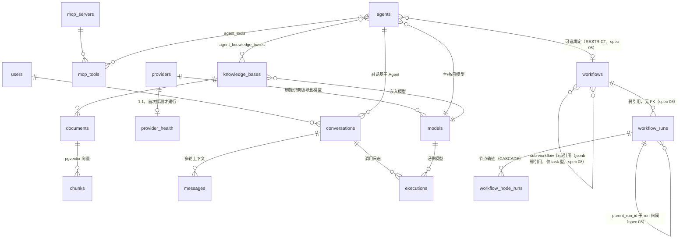

# 核心数据模型

> 本文档定义 Hify 的核心数据表与关系。是 CLAUDE.md《代码组织规范》的数据层补充：每张表归一个模块的 `service/model.go`，跨模块只传 schema 不传 model。

## 总览

- **PostgreSQL（含 pgvector）**：约 20 张事实表，唯一持久化数据源。
- **Redis-only**：预算 / 限流计数、配置缓存、语义缓存答案、登录 session——是状态/缓存，不建表。
- 向量召回走 `chunks` 表的 pgvector 列（建表即建 HNSW 索引）。

## ER 图



## 表清单（按模块）

### auth
- `users` — 最简登录账号（用户名 + 密码哈希）

### provider
- `providers` — 提供商配置（五类：openai/claude/gemini/ollama/openai_compatible；base_url、`auth_config` jsonb 密钥值级加密、`extra_config` Profile 覆盖白名单、enabled）
- `models` — 提供商下的模型（`name` 展示名 / `model_id` API 标识；chat 与 embedding 两类能力；价格、`source` 双源管理、`extra_params` 白名单）
- `provider_health` — 探测结果（1:1，独立表隔离探测写与配置缓存；unknown/up/degraded/down 状态机；熔断等运行时状态不落库）
- 决策与 DDL 详见 [docs/changelog/provider/db_model.md](../changelog/provider/db_model.md)

### mcp
- `mcp_servers` — MCP 工具服务器配置（transport、command/url、env）
- `mcp_tools` — 各 server 暴露的工具（名称、描述、参数 schema）

### agent（关系枢纽）
- `agents` — Agent 配置（系统提示词、温度、max_output_tokens；引用主模型 + 备用模型；可选绑定一个工作流 `workflow_id`，spec 05）
- `agent_tools` — 关联表：Agent ↔ MCP 工具（多对多；绑定=授权，粒度到工具不到 server）
- `agent_knowledge_bases` — 关联表：Agent ↔ 知识库（多对多）

### rag
- `knowledge_bases` — 知识库（引用其嵌入模型）
- `documents` — 上传文档（TXT/MD 元信息 + 原文）
- `chunks` — 固定长度分块（**pgvector 向量列 + HNSW 索引**，召回走这张表）

### chat
- `conversations` — 对话会话（归属用户 + 基于某 Agent）
- `messages` — 多轮消息（user/assistant/tool 角色，按顺序串成上下文）
- 全链路数据流与字段明细见 [docs/changelog/chat/data_flow_and_model.md](../changelog/chat/data_flow_and_model.md)（executions 字段明细同此文档）

### workflow
- `workflows` — 工作流主表（name 唯一、status 状态机、`type` 分型 chat/task 不可变、`input_schema`/`output_schema` 仅 task 型，spec 08）
- `workflow_nodes` — 节点（llm/knowledge_retrieval/condition/api/tool/end/workflow，config 按类型密封；`workflow` = sub-workflow 嵌套引用，spec 08）
- `workflow_edges` — 边（source→target，condition 分支表达式）
- `workflow_runs` — 执行轨迹（每次运行一行，spec 06）：append-only 收尾统一写、无 RUNNING 态；**弱引用 workflows（无 FK）**——workflow 删除后轨迹保留；`parent_run_id` 记子 run 归属（spec 08）
- `workflow_node_runs` — 节点执行轨迹（每节点一行，spec 06）：seq 是回放顺序唯一事实源；input/output 为截断摘要非 ctx 全量快照

### platform/logging
- `executions` — 运行日志（每次 LLM 调用：输入/输出/工具链/token/耗时/供应商/模型/错误类，排障唯一线索）

## 关系明细

```
providers 1──N models                          # 一个提供商多个模型（ON DELETE CASCADE）
providers 1──1 provider_health                 # 探测结果，惰性建行（ON DELETE CASCADE）

mcp_servers 1──N mcp_tools                     # 一个 server 多个工具

agents N──1 models         (model_id 主模型)
agents N──1 models         (fallback_model_id 备用，一期不用)
agents N──M mcp_tools      via agent_tools
agents N──M knowledge_bases via agent_knowledge_bases
agents N──1 workflows      (workflow_id 可空，ON DELETE RESTRICT，spec 05)

knowledge_bases N──1 models (embedding_model_id 嵌入模型)
knowledge_bases 1──N documents
documents 1──N chunks                          # chunks = pgvector 向量表

users 1──N conversations
agents 1──N conversations                      # 对话基于某 Agent
conversations 1──N messages                    # 多轮上下文

executions N──1 conversations / messages       # 对话路径的调用日志
executions N──1 models / providers             # 记录调用的是哪家哪个模型
workflows 1──N workflow_nodes                  # 一个工作流多个节点（ON DELETE CASCADE）
workflows 1──N workflow_edges                  # 一个工作流多条边（ON DELETE CASCADE）
workflows ──(LLM 节点调用)──▶ executions        # 工作流节点的调用也进 executions
workflows 1──N workflow_runs                   # 运行轨迹（弱引用：无 FK，workflow 删除后轨迹保留，spec 06）
workflow_runs 1──N workflow_node_runs          # 节点轨迹（ON DELETE CASCADE）
workflows N──M workflows                       # sub-workflow 嵌套（workflow 节点 jsonb 弱引用被引图 id，只许嵌 task 型，环/链深由 R11 校验，spec 08）
workflow_runs 1──N workflow_runs               # 子 run 归属（parent_run_id 弱引用，父收尾回填，spec 08）
```

## Redis-only（不建 PG 表）

- **预算 / 限流计数**（`INCR` + 过期）—— `platform/budget`
- **配置类 Cache-Aside**（TTL 5min + 写时删 key）
- **语义缓存答案**（pgvector 命中后存 Redis）
- **登录 session**（最简登录，不放 PG）

## 模块归属对照

| 表 | 所属模块 | model 位置 |
|---|---|---|
| users | auth | `auth/service/model.go` |
| providers, models, provider_health | provider | `provider/service/model.go` |
| mcp_servers, mcp_tools | mcp | `mcp/service/model.go` |
| agents, agent_tools, agent_knowledge_bases | agent | `agent/service/model.go` |
| knowledge_bases, documents, chunks | rag | `rag/service/model.go` |
| conversations, messages | chat | `chat/service/model.go` |
| workflows, workflow_nodes, workflow_edges, workflow_runs, workflow_node_runs | workflow | `workflow/service/model.go` |
| executions | platform/logging | `platform/logging/model.go` |

> 跨模块数据需求一律在 service 层分次查询后组装，禁止 JOIN 他模块的表（见 CLAUDE.md《跨模块调用规则》禁止清单）。
